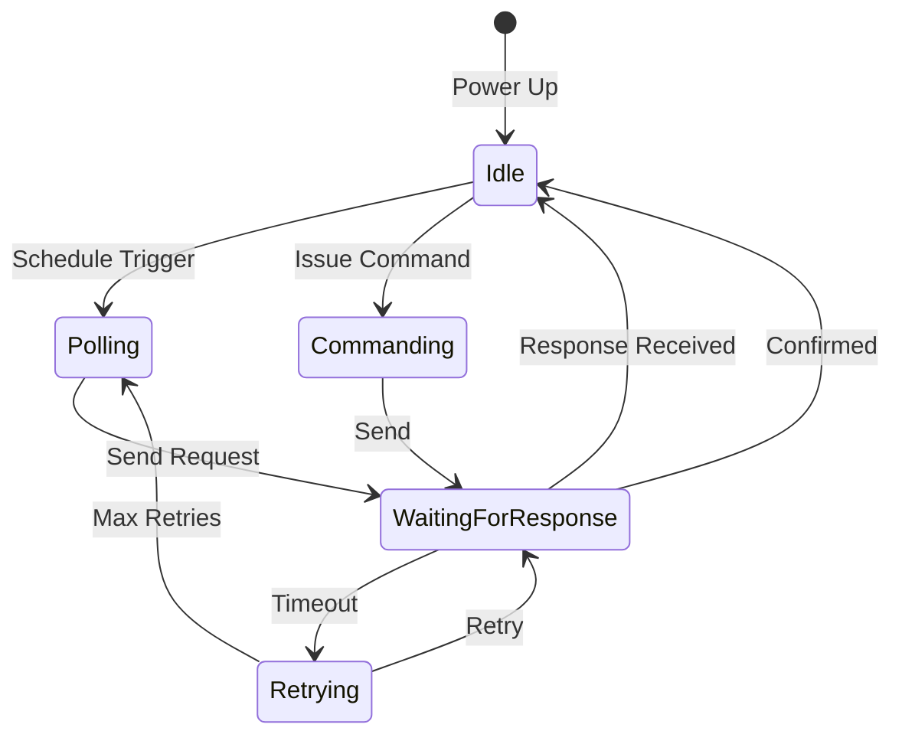
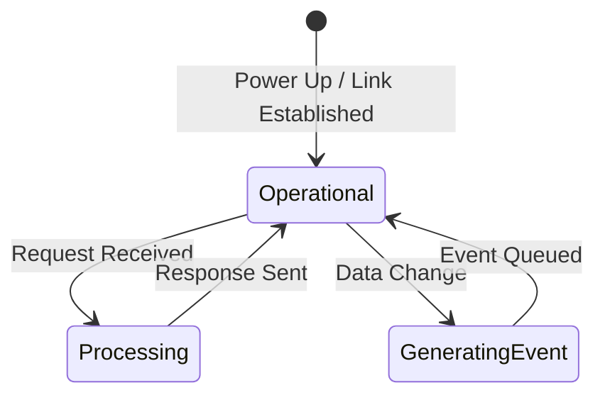

# What are the core concepts of DNP3?

## Purpose

This document establishes the fundamental concepts that underpin all DNP3 operations. Understanding these core concepts is essential before studying individual protocol layers.

## Problem Being Solved

DNP3 must support complex SCADA operations while remaining implementable and interoperable. These core concepts provide the mental model for understanding the entire protocol.

## Fundamental Concepts

### 1. Master-Outstation Architecture

DNP3 uses a **master-outstation** (also called master-slave or client-server) communication model.

**Master Station**:
- Central control system
- Initiates all communication
- Polls outstations for data
- Issues control commands
- Typically one per DNP3 network

**Outstation** (RTU/IED):
- Remote field device
- Responds to master requests
- Collects data from connected equipment
- Executes control commands
- Can be dozens or hundreds per system

```
┌─────────────────┐          REQUEST         ┌─────────────────┐
│                 │ ───────────────────────► │                 │
│      MASTER      │                          │    OUTSTATION   │
│      STATION     │ ◄─────────────────────── │      (RTU)      │
│                 │          RESPONSE         │                 │
└─────────────────┘                          └─────────────────┘
```

**Key point**: The master always initiates. Outstations never initiate except for unsolicited responses (which are responses to enable/disable commands).

### 2. Data Communication Modes

DNP3 supports multiple communication patterns:

| Mode | Description | Use Case |
|------|-------------|----------|
| **Polled** | Master requests, outstation responds | Periodic data collection |
| **Unsolicited** | Outstation sends without request | Event-driven data |
| **Solicited** | Response to master request | All normal operations |
| **Confirmed** | Requires acknowledgment | Critical operations |
| **Unconfirmed** | No acknowledgment | Best-effort data |

### 3. Data Representation

DNP3 defines standard data types:

| Type | Description | Example |
|------|-------------|---------|
| **Binary Input** | On/Off, True/False | Breaker status |
| **Binary Output** | Controllable on/off | Breaker control |
| **Analog Input** | Continuous values | Voltage, current |
| **Analog Output** | Controllable analog | Setpoint |
| **Counter** | Counting values | Energy pulse count |
| **Time and Date** | Timestamp values | Event timestamps |

Each type has specific encoding rules defined in the object model.

### 4. The Database Concept

The outstation maintains a **virtual database** of data points:

- Organized by object groups and variations
- Each point has an index within the group
- Points have current value and quality
- Points can generate events (changes)
- Database is the source of all response data

**Database ≠ Physical Memory**: The database is a logical concept. Implementation may use any internal structure.

### 5. Event Generation

Outstations can **detect changes** and generate events:

- Binary input change detected
- Analog value exceeds deadband
- Counter change detected
- Quality flag change detected

Events are:
- Stored in event buffers
- Reported to master (polled or unsolicited)
- Timestamp with quality indicators

### 6. Classes

Data points are assigned to **classes** for prioritization:

| Class | Priority | Typical Content |
|-------|----------|-----------------|
| Class 0 | Highest | Static data (current values) |
| Class 1 | High | High-priority events |
| Class 2 | Medium | Medium-priority events |
| Class 3 | Low | Low-priority events |

Class assignment is configurable per point.

### 7. Confirmation and Retry

Critical operations require **confirmation**:

1. Master sends request
2. Outstation responds
3. Master sends confirmation (ACK)
4. If no response, master retries

**FCB (Frame Count Bit)**: Provides confirmation mechanism for data link layer.

**FIR/FIN (First/Last)**: Indicates fragment boundaries in transport layer.

### 8. Sequence Numbers

Sequence numbers track message order:

- **Transaction sequence**: Tracks request-response pairs
- **FCB**: Data link confirmation bit
- **Transport FIN**: Indicates final fragment

See [210-sequence-numbers.md](210-sequence-numbers.md) for detailed sequence number behavior.

## Relationships Between Concepts

```
┌─────────────────────────────────────────────────────────────────┐
│                         MASTER STATION                           │
│  ┌─────────────┐  ┌─────────────┐  ┌─────────────────────────┐ │
│  │   Polling   │  │  Unsolicited │  │      Commands           │ │
│  │   Engine    │  │   Handler    │  │      Issuer             │ │
│  └─────────────┘  └─────────────┘  └─────────────────────────┘ │
└─────────────────────────────────────────────────────────────────┘
                              │
                              ▼
┌─────────────────────────────────────────────────────────────────┐
│                        OUTSTATION (RTU)                          │
│  ┌─────────────┐  ┌─────────────┐  ┌─────────────────────────┐ │
│  │  Database   │  │    Event    │  │    Control              │ │
│  │  Manager    │  │   Buffers   │  │    Executor             │ │
│  └─────────────┘  └─────────────┘  └─────────────────────────┘ │
└─────────────────────────────────────────────────────────────────┘
```

## State Machines

### Master State Machine (Conceptual)



### Outstation State Machine (Conceptual)



## Common Misconceptions

### Misconception 1: "The database is a SQL database"

**Reality**: The database is a logical concept. Implementation may use arrays, maps, linked lists, or any structure. The protocol doesn't specify internal representation.

### Misconception 2: "All events are sent immediately"

**Reality**: Events are queued and reported according to configuration. Events may be held until polled or sent unsolicited based on settings.

### Misconception 3: "Classes are data types"

**Reality**: Classes are priority groupings, not data types. A binary input and an analog input can both be Class 1.

### Misconception 4: "Unsolicited means no response"

**Reality**: Unsolicited responses ARE responses - they just aren't in response to a specific request. They still require application-level confirmation in many cases.

## Engineering Notes

### Why These Concepts Matter

1. **Master-outstation model** defines all communication patterns
2. **Database concept** is the foundation of the object model
3. **Events enable efficiency** - only changed data is transmitted
4. **Classes enable prioritization** - critical data gets through first
5. **Confirmation enables reliability** - critical operations are verified

### Implementation Implications

When implementing DNP3:

- Model the database conceptually before coding
- Implement event detection before event reporting
- Use state machines for all stateful operations
- Track sequence numbers correctly
- Handle all communication modes

## Relationships

- **Foundation for**: All protocol layers
- **Prerequisite for**: [050-layer-model.md](050-layer-model.md), [060-link-layer.md](060-link-layer.md)
- **Related**: Events ([150-events.md]), Classes ([160-class-polling.md])

## References

- IEEE 1815-2012 Section 3: Definitions and Acronyms
- IEEE 1815-2012 Section 4: Architecture Overview
- DNP3 Users Group Technical Guidelines
