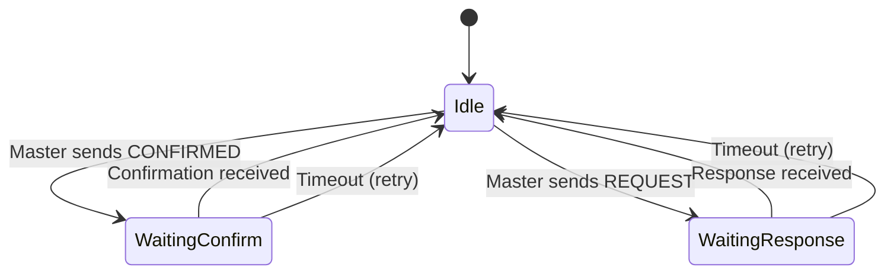
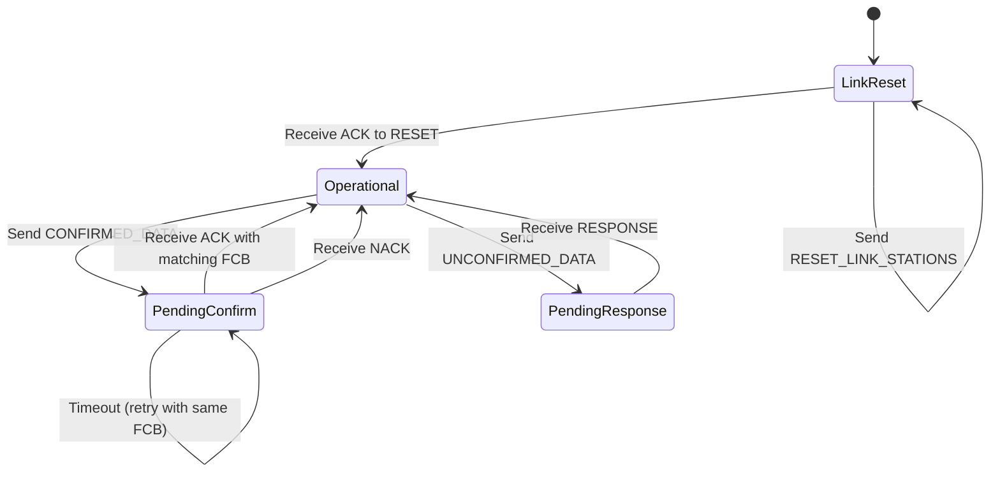
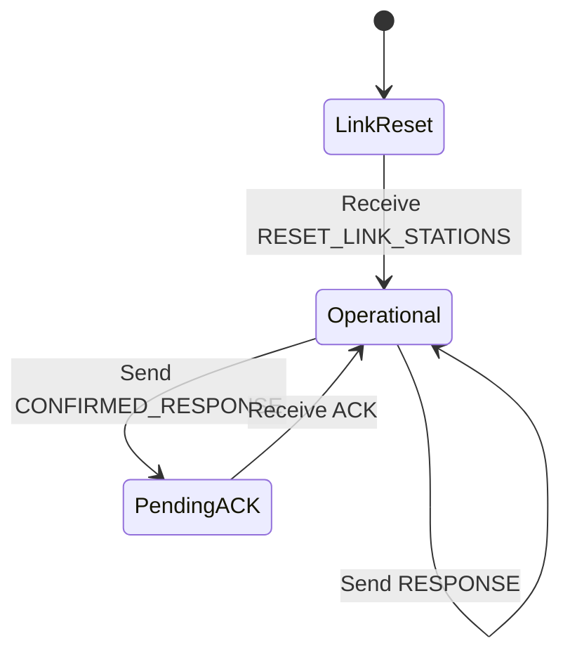

# What is the DNP3 Data Link Layer?

## Purpose

The DNP3 Data Link Layer provides **frame-level communication** between devices. It handles framing, addressing, error detection, and basic confirmation mechanisms.

## Problem Being Solved

Network communication requires:

1. **Message boundaries** - Where does one message end and another begin?
2. **Error detection** - Did the data arrive correctly?
3. **Addressing** - Which device should receive this?
4. **Flow control** - Who's allowed to talk?

The data link layer solves these problems before the transport or application layers even see data.

## Frame Structure

### Data Link Frame Format

```
┌────────┬────────┬────────┬────────┬────────┬──────────┬────────┬────────┐
│  0x05  │ Length │  Ctrl  │ Dest   │ Source │  Data    │  CRC   │  CRC   │
│ (0x0564│ (1 B)  │  (1 B) │ (2 B)  │ (2 B)  │ (0-292 B)│ (1 B)  │ (1 B)  │
│ sync)  │        │        │ Addr   │ Addr   │          │ (Low)  │ (High) │
└────────┴────────┴────────┴────────┴────────┴──────────┴────────┴────────┘
```

### Field Descriptions

| Field | Size | Description |
|-------|------|-------------|
| Start Bytes | 2 | `0x05 0x64` (0x0564) indicates DNP3 frame |
| Length | 1 | Number of bytes from Ctrl to end of Data |
| Control | 1 | Control byte (direction, confirmation, etc.) |
| Destination | 2 | Destination address (big-endian) |
| Source | 2 | Source address (big-endian) |
| Data | 0-292 | Application data |
| CRC | 2 | CRC-16-DNP error check |

### Maximum Frame Size

- **Header**: 10 bytes (0x0564 + length + ctrl + dst + src + 2 CRC)
- **Data**: 292 bytes maximum
- **Total**: 292 + 10 = **302 bytes maximum**
- **User data**: ~292 bytes (some bytes used by transport)

### Minimum Frame Size

- **Header only**: 10 bytes (no data)
- **Used for**: Confirmations, link status requests

## CRC Calculation

DNP3 uses **CRC-16-DNP** for error detection:

### Polynomial

```
x^16 + x^13 + x^12 + x^11 + x^10 + x^8 + x^6 + x^5 + x^2 + 1
```

### CRC Calculation Rules

1. **Byte order**: CRC is calculated with the LSB first
2. **Coverage**: CRC covers all bytes from Length through Data
3. **Two CRC bytes**: Each 16-bit quantity has a CRC
4. **Seed**: Initial value is 0x0000

### CRC Position

Each pair of bytes has a corresponding CRC:

| Bytes | CRC |
|-------|-----|
| Length + Ctrl | CRC1 |
| Destination Addr (both bytes) | CRC2 |
| Source Addr (both bytes) | CRC3 |
| Data[0:2] | CRC4 |
| Data[2:4] | CRC5 |
| ... | ... |

## Control Byte Format

The control byte contains multiple bit fields:

```
┌───┬───┬───┬───┬───┬───┬───┬───┐
│DIR│PRM│  FCB  │  FCV │  DFC│RES│
└───┴───┴───┴───┴───┴───┴───┴───┘
  7   6    5-3     2     1    0
```

### Bit Definitions

| Bit | Name | Description |
|-----|------|-------------|
| 7 | DIR | Direction: 1=Master-to-Outstation, 0=Outstation-to-Master |
| 6 | PRM | Primary: 1=Primary station (initiates), 0=Secondary station (responds) |
| 5-3 | FCB | Frame Count Bit (confirmation mechanism) |
| 2 | FCV | Frame Count Bit Valid: 1=FCB is meaningful |
| 1 | DFC | Data Link Busy / Flow Control |
| 0 | RES | Reserved (should be 0) |

### Function Codes (Bits 5-3 when PRM=1)

| FCB Value | Function Code | Name |
|-----------|--------------|------|
| 0 | 0 | Reset Link Stations |
| 0 | 1 | Reset Link Status |
| 0 | 2 | Unsolicited Test Function |
| 0 | 3 | Return Link Status |
| 1 | 4 | Confirmed User Data |
| 1 | 5-15 | Reserved |

### Function Codes (Bits 5-3 when PRM=0)

| FCB Value | Function Code | Name |
|-----------|--------------|------|
| 0 | 0 | Acknowledgment |
| 0 | 1 | Negative Acknowledgment |
| 0 | 2 | Link Status |
| 1 | 3 | Not Supported / Reserved |
| 1 | 4 | Confirmed User Data |
| 1 | 5-15 | Reserved |

## Addressing

### Address Range

- **Range**: 0x0000 to 0xFFFF (65,536 addresses)
- **Broadcast**: 0xFFFF is broadcast (no response expected)
- **All-stations reset**: 0xFFFA is all-stations reset
- **Unaddressed**: Some implementations use 0x0000

### Address Assignment

| Address | Usage |
|---------|-------|
| 0x0000 | Default/unconfigured |
| 0x0001 - 0xFFFA | Normal addresses |
| 0xFFFB | Virtual terminal |
| 0xFFFC | Secondary channel |
| 0xFFFD | Primary channel |
| 0xFFFE | Reserved |
| 0xFFFF | Broadcast |

## Data Link Modes

### Unbalanced Mode

Most common mode for TCP/IP.

**Characteristics**:
- Master is always Primary
- Outstations are always Secondary
- Master initiates all communication
- Outstations only respond

**State machine**:


### Balanced Mode

Used for some serial and peer-to-peer applications.

**Characteristics**:
- Either device can be Primary
- Either device can initiate
- Frame Count Bit (FCB) used for confirmation

**FCB Toggle**: Primary toggles FCB on each confirmed frame. Secondary acknowledges by echoing FCB.

## State Machine

### Primary Station (Master) States



### Secondary Station (Outstation) States



## Confirmations

### Why Confirmations?

The data link layer provides **unreliable** delivery. Confirmations allow higher layers to request retransmission.

### Confirmation Process

1. Primary sends frame with FCV=1 and FCB bit set
2. Secondary receives and validates
3. Secondary responds with matching FCB bit
4. If mismatch or timeout, primary retries

### Confirmation vs. No Confirmation

| Frame Type | Requires Confirmation |
|-----------|---------------------|
| RESET_LINK_STATIONS | Yes (first time) |
| CONFIRMED_USER_DATA | Yes |
| UNCONFIRMED_USER_DATA | No |
| Status requests | Sometimes |

## Data Link Layer Functions

### Function Codes (Primary to Secondary)

| Code | Name | Description |
|------|------|-------------|
| 0 | RESET_LINK_STATIONS | Reset link and clear FCB state |
| 1 | RESET_LINK_STATUS | Reset link status only |
| 2 | UNSOLICITED_TEST_FUNCTION | Test function (unsolicited) |
| 3 | RETURN_LINK_STATUS | Request link status |
| 4 | CONFIRMED_USER_DATA | User data with confirmation |
| 5-15 | Reserved | - |

### Function Codes (Secondary to Primary)

| Code | Name | Description |
|------|------|-------------|
| 0 | ACK | Positive acknowledgment |
| 1 | NACK | Negative acknowledgment (busy) |
| 2 | LINK_STATUS | Link status response |
| 3 | NOT_SUPPORTED | Function not supported |
| 4 | CONFIRMED_USER_DATA | Confirmed response |
| 5-15 | Reserved | - |

## Sequence Diagrams

### Successful Communication

```
Master                                          Outstation
   │                                               │
   │ ──── RESET_LINK_STATIONS ──────────────────► │
   │                                               │
   │ ◄─────── ACK ───────────────────────────────── │
   │                                               │
   │ ──── CONFIRMED_USER_DATA ───────────────────► │
   │      (FCB=0, FCV=1)                           │
   │                                               │
   │ ◄─────── RESPONSE ──────────────────────────── │
   │      (FCB echoed)                              │
   │                                               │
   │ ──── ACK (FCB echoed) ───────────────────────► │
   │                                               │
```

### Confirmation Timeout

```
Master                                          Outstation
   │                                               │
   │ ──── CONFIRMED_USER_DATA ───────────────────► │
   │      (FCB=0)                                  │
   │                                               │
   │  X (Timeout)                                  │
   │                                               │
   │ ──── CONFIRMED_USER_DATA ───────────────────► │
   │      (FCB=0, same!)                           │
   │                                               │
   │ ◄─────── ACK ───────────────────────────────── │
   │                                               │
```

## Common Mistakes

### Mistake 1: Ignoring FCB State

**Problem**: Not tracking FCB state causes confirmation failures.

**Fix**: FCB must toggle on each confirmed frame. Track state machine correctly.

### Mistake 2: Wrong CRC Calculation

**Problem**: CRC errors on valid frames.

**Fix**: Use correct polynomial, LSB-first calculation, and proper seed.

### Mistake 3: Wrong Address Endianness

**Problem**: Address mismatch.

**Fix**: DNP3 uses big-endian (network order) for addresses.

### Mistake 4: Confusing DIR and PRM

**Problem**: Incorrect frame interpretation.

**Fix**: DIR indicates direction. PRM indicates who initiated.

### Mistake 5: Broadcasting Without Understanding

**Problem**: Broadcast frames can't be confirmed.

**Fix**: Don't expect responses to 0xFFFF broadcasts.

## Engineering Notes

### Performance Implications

- Frame overhead is 10 bytes minimum
- CRC adds 2 bytes per 2 bytes of data
- Maximum user data: ~292 bytes (frame limit)
- Transport layer fragmentation needed for larger messages

### Reliability Implications

- CRC-16 catches all single and double-bit errors
- CRC-16 misses some burst errors (but unlikely)
- Confirmations add round-trip latency
- FCB prevents duplicate reception

### Implementation Notes

1. **CRC hardware**: Many MCUs have CRC peripherals
2. **State machines**: Implement as explicit state, not flags
3. **Timeouts**: Per-frame timeout, not global
4. **Broadcast**: Handle gracefully, don't wait for response

## Relationships

- **Parent**: [050-layer-model.md](050-layer-model.md)
- **Sibling**: [070-transport-layer.md](070-transport-layer.md)
- **Related**: [210-sequence-numbers.md](210-sequence-numbers.md), [220-fcb.md](220-fcb.md)

## References

- IEEE 1815-2012 Section 5: Data Link Layer
- IEEE 1815-2012 Section 5.2: Frame Format
- IEEE 1815-2012 Section 5.4: Data Link Functions
- IEEE 1815-2012 Section 5.5: Error Detection and Recovery
