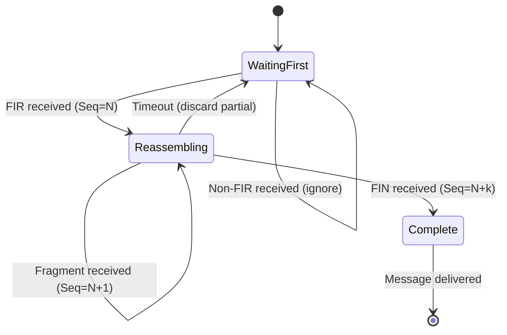

# What is the DNP3 Transport Layer?

## Purpose

The DNP3 Transport Layer enables **large messages** by segmenting Application PDUs into multiple Data Link frames and reassembling them on reception.

## Problem Being Solved

Application layer messages can be larger than one Data Link frame:

- **Data Link limit**: ~292 bytes of user data
- **Application needs**: Messages can be kilobytes
- **Solution**: Fragment into multiple frames

The transport layer solves this by:
1. Breaking large messages into fragments
2. Adding transport header to each fragment
3. Reassembling fragments into complete message
4. Tracking first/last fragment boundaries

## Transport Header

The transport header is **1 byte** inserted at the start of each Data Link frame's data area:

```
┌──────────────────────────────────────────────────────────────────┐
│                         DATA LINK FRAME                          │
│  ┌──────┬──────────────────────────────┐                       │
│  │ Ctrl │        Transport + Data       │                       │
│  └──────┴──────────────────────────────┘                       │
└──────────────────────────────────────────────────────────────────┘
                              │
                              ▼
┌──────────────────────────────────────────────────────────────────┐
│                     TRANSPORT HEADER (1 B)                        │
│  ┌────────────────────────────────────────────────────────────┐  │
│  │    1 bit    │    1 bit    │         6 bits               │  │
│  │     FIR     │     FIN      │       Sequence Number        │  │
│  └────────────────────────────────────────────────────────────┘  │
│                              │                                   │
│                              ▼                                   │
│  ┌────────────────────────────────────────────────────────────┐  │
│  │                    USER DATA (0-292 B)                     │  │
│  └────────────────────────────────────────────────────────────┘  │
└──────────────────────────────────────────────────────────────────┘
```

## Transport Header Fields

### FIR (First Fragment)

- **Bit 7** (0x80)
- **Value 1**: This is the first fragment of a message
- **Value 0**: This is a subsequent fragment

### FIN (Final Fragment)

- **Bit 6** (0x40)
- **Value 1**: This is the final fragment of a message
- **Value 0**: More fragments follow

### Sequence Number

- **Bits 5-0** (0x3F)
- **Range**: 0-63
- Increments modulo 64 for each fragment
- Used to detect missing fragments

### Combination Rules

| FIR | FIN | Meaning |
|-----|-----|---------|
| 1 | 1 | Single fragment message |
| 1 | 0 | First of multi-fragment message |
| 0 | 0 | Middle fragment of message |
| 0 | 1 | Final fragment of message |

## Fragment Size Calculation

### Data Link Frame Limits

```
Total Frame Size = 292 bytes (maximum)
Frame Structure:
  - Sync (2) + Length (1) + Ctrl (1) + Dst (2) + Src (2) = 8 bytes header
  - CRC (2) minimum footer
  - = 8 + 2 = 10 bytes overhead
  - Maximum data = 292 - 10 = 282 bytes
```

### Transport Overhead

```
Transport header = 1 byte
Maximum user data per frame = 282 - 1 = 281 bytes
```

### Fragment Payload Capacity

| Message Part | Size |
|-------------|------|
| Data Link overhead | 10 bytes |
| Transport header | 1 byte |
| Maximum fragment data | 281 bytes |
| Data Link CRC overhead | 2 bytes per 16 bytes |
| Effective maximum | ~250-275 bytes per fragment |

## Segmentation Process

### Sending (Fragmentation)

```
Application PDU (500 bytes)
           │
           ▼
┌─────────────────────────────────────┐
│  Fragment 1: FIR=1, FIN=0, Seq=0    │
│  Data: 250 bytes                    │
└─────────────────────────────────────┘
           │
           ▼
┌─────────────────────────────────────┐
│  Fragment 2: FIR=0, FIN=0, Seq=1    │
│  Data: 250 bytes                    │
└─────────────────────────────────────┘
           │
           ▼
┌─────────────────────────────────────┐
│  Fragment 3: FIR=0, FIN=1, Seq=2    │
│  Data: 1 byte (FINAL)              │
└─────────────────────────────────────┘
```

### Receiving (Reassembly)

```
┌─────────────────────────────────────┐
│  Buffer: 3 fragments reassembled    │
│  Complete PDU: 501 bytes            │
└─────────────────────────────────────┘
```

## Reassembly Rules

### Valid Message Assembly

1. **First fragment required**: FIR must be set on first fragment
2. **Sequential sequence numbers**: Seq increments by 1 (mod 64) for each fragment
3. **FIN on last**: FIN must be set on the final fragment
4. **No gaps**: Missing sequence numbers invalidate the message

### Invalid Scenarios

| Scenario | Result |
|----------|--------|
| Missing FIR | Discard fragment, request retransmission |
| Gap in sequence | Discard partial message |
| FIN without preceding FIR | Discard |
| Duplicate sequence | Discard duplicate |
| Buffer overflow | Discard partial message |

## Sequence Number Behavior

### Increment Rules

- Sequence number starts at any value
- Increments by 1 for each fragment
- Wraps from 63 to 0
- Independent for each direction

### Sequence Number Scope

Sequence numbers are **per-session**, not per-message:

```
Session Start:
  - Transmit Seq = 0
  - Receive Seq = 0

After each fragment sent:
  - Transmit Seq = (Transmit Seq + 1) % 64

On valid fragment received:
  - Receive Seq = (Receive Seq + 1) % 64
```

### Sequence Number Mismatch

If received Seq doesn't match expected:

```
Expected Seq = 5
Received Seq = 7

Message is INVALID
- Discard fragments
- Request retransmission or restart session
```

## State Machine

### Reassembly State Machine



## Timeout Behavior

### Reassembly Timeout

If fragments don't complete within timeout:

1. Discard partial message
2. Log error
3. Request retransmission at application layer
4. Reset reassembly state

**Typical timeout**: 5-10 seconds

### Timeout Value Selection

| Factor | Consideration |
|--------|---------------|
| Network latency | Longer for WAN, shorter for LAN |
| Fragment count | More fragments = longer needed |
| Device capability | Resource-constrained devices may need more time |

## Sequence Diagrams

### Successful Multi-Fragment Send

```
Master                                          Outstation
   │                                               │
   │ ──── Frame: FIR=1,FIN=0,Seq=0 ───────────────► │
   │ ──── Frame: FIR=0,FIN=0,Seq=1 ───────────────► │
   │ ──── Frame: FIR=0,FIN=1,Seq=2 ───────────────► │
   │                    (3 fragments sent)          │
   │                                               │
   │ ◄────── ACK ────────────────────────────────── │
   │                                               │
```

### Fragment Loss

```
Master                                          Outstation
   │                                               │
   │ ──── Frame: FIR=1,FIN=0,Seq=0 ───────────────► │
   │ ──── Frame: FIR=0,FIN=0,Seq=1 ───────────────► │
   │                    (Fragment 2 lost)            │
   │ ──── Frame: FIR=0,FIN=1,Seq=2 ───────────────► │
   │                                               │
   │                    Outstation detects gap:     │
   │                    Expected Seq=1, got Seq=2   │
   │                    Discards partial message    │
   │                                               │
   │ ◄────── NACK or nothing ──────────────────────── │
   │                                               │
   │ ──── Retry: Full message again ────────────────► │
   │                                               │
```

## Common Mistakes

### Mistake 1: Wrong FIR/FIN Logic

**Problem**: Single fragment sent with FIR=0 or FIN=0.

**Fix**: Single fragment MUST have both FIR=1 AND FIN=1.

### Mistake 2: Sequence Number Reset

**Problem**: Sequence number resets on each message.

**Fix**: Sequence number is session-scoped. Only resets on session start.

### Mistake 3: Buffer Size Mismatch

**Problem**: Buffer too small for maximum message.

**Fix**: Support messages up to transport limit. Buffer must handle reassembly.

### Mistake 4: Ignoring Timeout

**Problem**: Partial messages held indefinitely.

**Fix**: Implement reassembly timeout. Discard and request retry.

### Mistake 5: Not Tracking Fragment State

**Problem**: Can't detect missing fragments.

**Fix**: Track expected sequence number and missing ranges.

## Engineering Notes

### Performance Implications

| Aspect | Impact |
|--------|--------|
| Fragment overhead | 1 byte per fragment |
| Small messages | No overhead (1 fragment) |
| Large messages | 1 byte overhead per ~275 bytes |
| Fragment loss | Entire message must retry |

### Memory Requirements

| Message Size | Buffer Required |
|-------------|-----------------|
| < 275 bytes | 275 bytes |
| 1 KB | 1 KB |
| 4 KB | 4 KB |
| 10 KB | 10 KB |

**Recommendation**: Support at least 4-10 KB buffers for typical SCADA data.

### Reliability Implications

- Transport layer provides **reliable** delivery only within session
- Fragment loss requires **full message retransmission**
- Sequence numbers detect duplicates and gaps
- Timeout prevents indefinite waiting

### Implementation Notes

1. **Buffer management**: Pre-allocate buffers, reuse when possible
2. **Sequence tracking**: Use unsigned integer, handle wrap-around
3. **State machine**: Explicit states, not flag accumulation
4. **Timeout**: Per-message timeout, not global

## Fragmentation vs. No Fragmentation

### When Fragmentation Occurs

Fragmentation occurs when the Application PDU exceeds the maximum Data Link payload:

```
Application PDU size > 275 bytes → Fragmentation required
```

### When No Fragmentation Occurs

Single fragment when:

```
Application PDU size ≤ 275 bytes
FIR = 1, FIN = 1 (both set)
```

## Relationships

- **Parent**: [050-layer-model.md](050-layer-model.md)
- **Sibling**: [060-link-layer.md](060-link-layer.md)
- **Related**: [080-application-layer.md](080-application-layer.md), [200-fragmentation.md](200-fragmentation.md), [210-sequence-numbers.md](210-sequence-numbers.md)

## References

- IEEE 1815-2012 Section 6: Transport Functions
- IEEE 1815-2012 Section 6.2: Segmentation
- IEEE 1815-2012 Section 6.3: Reassembly
