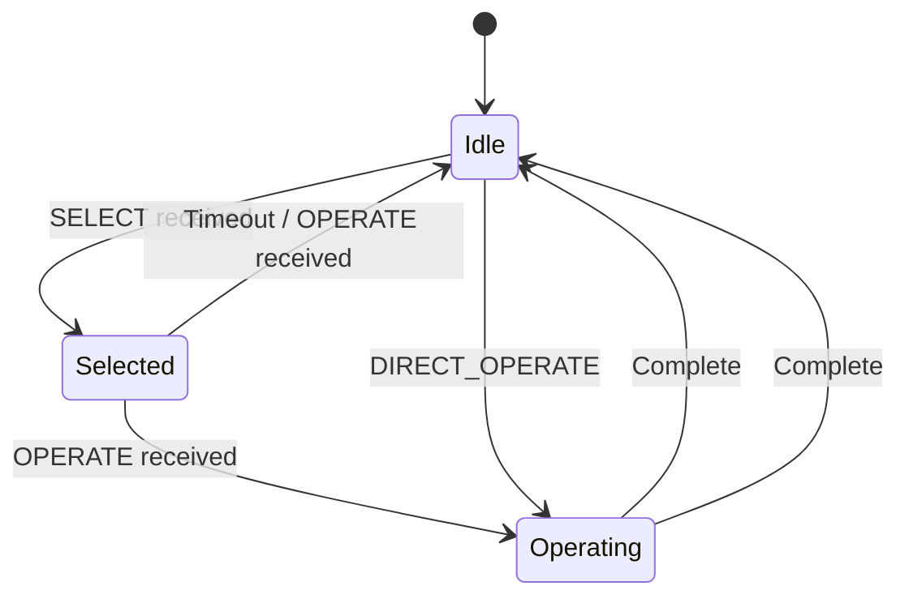

# What are DNP3 Controls?

## Purpose

DNP3 controls allow masters to **operate physical devices** through outstations. This includes binary (on/off) control and analog (setpoint) control with proper safety mechanisms.

## Problem Being Solved

SCADA control operations require:

1. **Safety** - Prevent accidental operations
2. **Verification** - Confirm operation completed
3. **Security** - Only authorized operations succeed
4. **Coordination** - Handle multiple control attempts

DNP3 provides a multi-step control process with confirmation at each stage.

## Control Architecture

### Control Flow

```
┌──────────────────────────────────────────────────────────────────┐
│                    CONTROL OPERATION FLOW                         │
├──────────────────────────────────────────────────────────────────┤
│                                                                   │
│  ┌─────────┐     ┌─────────┐     ┌─────────┐                    │
│  │  SELECT │────►│ OPERATE │────►│  FINAL  │                    │
│  └─────────┘     └─────────┘     └─────────┘                    │
│       │               │               │                          │
│       │               │               │                          │
│  ┌────┴────┐     ┌────┴────┐     ┌────┴────┐                   │
│  │ Check   │     │ Execute │     │ Verify  │                   │
│  │ Safe    │     │ Command │     │ Complete│                   │
│  └─────────┘     └─────────┘     └─────────┘                   │
│                                                                   │
└──────────────────────────────────────────────────────────────────┘
```

### Two-Phase Control

DNP3 uses **select-before-operate** (SBO) pattern:

1. **SELECT** - Verify the control is safe and available
2. **OPERATE** - Execute the previously selected control

This prevents:
- Accidental operation
- Race conditions
- Unauthorized operation (with security)

## Control Function Codes

### Binary Control

| Code | Name | Description |
|------|------|-------------|
| Function 4 | SELECT | Select control for operate |
| Function 5 | OPERATE | Execute selected control |
| Function 6 | DIRECT_OPERATE | Direct operate (select + operate) |
| Function 7 | DIRECT_OPERATE_NR | Direct operate, no response |

### Analog Control (Setpoint)

| Code | Name | Description |
|------|------|-------------|
| Function 4 | SELECT | Select analog output for operate |
| Function 5 | OPERATE | Execute selected setpoint |
| Function 6 | DIRECT_OPERATE | Direct operate setpoint |
| Function 7 | DIRECT_OPERATE_NR | Direct operate, no response |

## Binary Control Objects

### Group 12: Binary Output

Group 12 contains binary control objects:

| Variation | Name | Description |
|-----------|------|-------------|
| 1 | Latched On | Control to ON state |
| 2 | Latched Off | Control to OFF state |
| 3 | Pulse On | Momentary ON pulse |
| 4 | Pulse Off | Momentary OFF pulse |
| 5 | Pulse | Momentary pulse (duration specified) |
| 6 | Paired Pulse | Complementary pulse pair |

### Control Command Format (Group 12)

```
┌──────────────────────────────────────────────────────────────────┐
│                    BINARY OUTPUT COMMAND                          │
├──────────────────────────────────────────────────────────────────┤
│  Control Code (1 byte) │   Queue Priority │   Clear (1 byte)    │
├──────────────────────────────────────────────────────────────────┤
│  On Time (4 bytes) │ Off Time (4 bytes) │ Status (1 byte)       │
└──────────────────────────────────────────────────────────────────┘
```

### Control Code Bits

```
┌────────┬────────┬────────┬────────┬─────────────────────────────┐
│  TCM   │  TQR   │  CLS   │  QU    │         Reserved            │
│(1 bit) │(1 bit) │(1 bit) │(1 bit) │         (4 bits)            │
└────────┴────────┴────────┴────────┴─────────────────────────────┘
```

| Bit | Name | Description |
|-----|------|-------------|
| TCM | Trip/Close Model | 0=Trip, 1=Close (for paired) |
| TQR | Trip/Close Qualifier Required | 0=Not required, 1=Required |
| CLS | Close Before Open | 1=Close before opening |
| QU | Qualified | 1=Qualified by status |

### Timing Parameters

| Parameter | Description | Units |
|-----------|-------------|-------|
| On Time | Duration of ON state | Milliseconds |
| Off Time | Duration of OFF state | Milliseconds |
| Queue Priority | Priority in command queue | 0-3 |
| Clear | Clear pending commands | 0 or 1 |

### Pulse Operation

For pulse controls (Variation 3, 4, 5):

```
Timeline:
┌─────────────────────────────────────────────────────────────────┐
│                                                                 │
│  ON ────────────────────────────────────────────────────►        │
│  │ ON Time │ Off Time │                                        │
│  │ (1 sec) │ (0.5 sec)│                                        │
│                                                                 │
└─────────────────────────────────────────────────────────────────┘

Variation 3 (Pulse On): ON for 1 second, then OFF
Variation 4 (Pulse Off): OFF for 0.5 second, then ON
Variation 5 (Pulse): Specify both times
```

## Analog Control (Setpoint) Objects

### Group 43: Analog Output Status

Group 43 contains analog control objects:

| Variation | Encoding | Size |
|-----------|----------|------|
| 1 | 16-bit signed integer | 2 bytes |
| 2 | 32-bit signed integer | 4 bytes |
| 3 | 32-bit single-precision float | 4 bytes |
| 4 | 64-bit double-precision float | 8 bytes |
| 5 | 4-byte float | 4 bytes |
| 6 | 8-byte float | 8 bytes |

### Analog Output Command (Group 41)

```
┌──────────────────────────────────────────────────────────────────┐
│                    ANALOG OUTPUT COMMAND                          │
├──────────────────────────────────────────────────────────────────┤
│  Value (varies by variation) │  Status (1 byte)                  │
├──────────────────────────────────────────────────────────────────┤
│  Reserved (2 bytes) │  Queue Priority (1 byte) │ Clear (1 byte)  │
└──────────────────────────────────────────────────────────────────┘
```

## Select-Operate Sequence

### Step 1: SELECT

```
Master ──── SELECT ─────────────────────────────► Outstation
     │       Group 12, Variation 1                │
     │       Point Index: 5                      │
     │       Control Code: Latched On            │
     │       On Time: 0                          │
     │       Off Time: 0                          │
     │                                             │
     │ ◄─── RESPONSE ──────────────────────────────
     │       (Code 0) Success / (Code N) Error
```

### Step 2: OPERATE

```
Master ──── OPERATE ───────────────────────────► Outstation
     │       Group 12, Variation 1                │
     │       Point Index: 5                      │
     │       (Same control parameters)            │
     │                                             │
     │ ◄─── RESPONSE ──────────────────────────────
     │       (Code 0) Success / (Code N) Error
```

### Response Codes

| Code | Name | Description |
|------|------|-------------|
| 0 | SUCCESS | Operation completed successfully |
| 1 | TIMEOUT | Device did not respond in time |
| 2 | NO_SELECT | SELECT not performed first |
| 3 | BAD_VALUE | Value out of range |
| 4 | NOT_SUPPORTED | Function not supported |
| 5 | ALREADY_ACTIVE | Control already in progress |
| 6-127 | Reserved | - |

## Direct Operate

For situations requiring immediate operation:

### DIRECT_OPERATE (Function 6)

```
Master ──── DIRECT_OPERATE ────────────────────► Outstation
     │       (SELECT + OPERATE combined)         │
     │                                             │
     │ ◄─── RESPONSE ──────────────────────────────
     │       (Success or failure)
```

**Note**: Direct operate combines select and operate in one request. Some safety-critical applications may require separate steps.

### DIRECT_OPERATE_NR (Function 7)

```
Master ──── DIRECT_OPERATE_NR ───────────────► Outstation
     │       (No response expected)              │
     │                                             │
     │       (Timeout if no response)            │
```

**Note**: No response is sent. Master relies on subsequent poll or event to verify completion.

## Select Timeout

After SELECT, the control is reserved for a time window:

```
SELECT ──────────────────────────────► (Reserved for 5-10 seconds)
     │
     │ ◄─── Timeout ─────────────────────────────
     │       (Control automatically deselected)
```

- If OPERATE not received within timeout, selection expires
- Prevents accidental operation after timeout
- Timeout duration is device-specific

## Control States



## Safety Features

### 1. Select-Operate Separation

- Prevents accidental operation
- Allows human verification between steps
- Timeout provides additional safety

### 2. Queue Priority

Controls can be queued with priority:

| Priority | Meaning |
|----------|---------|
| 0 | Lowest priority |
| 1 | Low priority |
| 2 | Medium priority |
| 3 | High priority |

### 3. Clear Function

Setting Clear=1 removes pending commands for the point.

### 4. Status Verification

After operation, master should poll to verify completion.

## Common Misconceptions

### Misconception 1: "Direct operate is faster, use it always"

**Reality**: Direct operate bypasses safety checks. SELECT-OPERATE is preferred for safety-critical applications.

### Misconception 2: "Operate always works without SELECT"

**Reality**: Some outstations REQUIRE SELECT before OPERATE. Check device documentation.

### Misconception 3: "Controls don't need confirmation"

**Reality**: Critical controls should be confirmed. Use OPERATE with confirmation, not DIRECT_OPERATE_NR.

### Misconception 4: "Pulse duration is unlimited"

**Reality**: Pulse duration has limits (typically 0-60 seconds). Longer pulses may not be supported.

## Engineering Notes

### Performance Considerations

| Operation | Latency | Reliability |
|-----------|---------|-------------|
| SELECT | Low | Medium |
| OPERATE | Medium | High |
| DIRECT_OPERATE | Low | Lower |
| DIRECT_OPERATE_NR | Very Low | Lowest |

### Security Implications

- Secure Authentication (IEEE 1815-2012) should protect control operations
- Keys should have permission levels for different control types
- Audit logging should record all control attempts

### Implementation Notes

1. **Validate all parameters**: Check timing limits, queue priority
2. **Implement timeout**: SELECT timeout is required
3. **Track state**: Don't allow operate without select
4. **Handle errors**: Return proper error codes
5. **Log operations**: Record for audit trail

## Relationships

- **Parent**: [090-object-model.md](090-object-model.md)
- **Related**: [280-security.md](280-security.md), [190-confirmations.md](190-confirmations.md), [100-measurements.md](100-measurements.md)

## References

- IEEE 1815-2012 Section 7.7: Control Functions
- IEEE 1815-2012 Section 7.7.4: Select-Operate Sequence
- IEEE 1815-2012 Group 12: Binary Output
- IEEE 1815-2012 Group 41: Analog Output Command
- IEEE 1815-2012 Group 43: Analog Output Status
