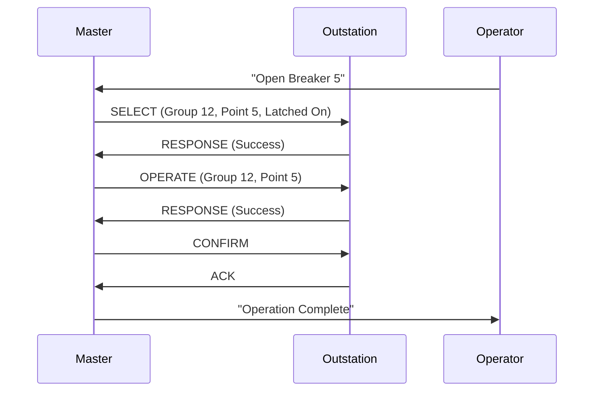
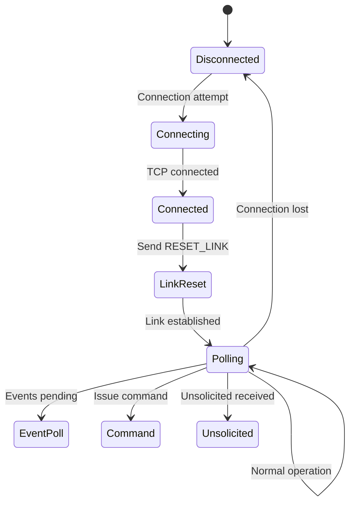

# What is a DNP3 Master?

## Purpose

The DNP3 **Master Station** is the central control system that initiates all communication. It polls outstations for data, issues commands, and manages the overall SCADA system.

## Problem Being Solved

SCADA systems need a **central coordinator** to:

1. **Initiate communication** - Outstations don't initiate (except unsolicited)
2. **Coordinate data collection** - Poll multiple outstations efficiently
3. **Issue controls** - Execute operations across the system
4. **Manage state** - Track system-wide status

The Master fulfills all these roles.

## Master Architecture

### Position in SCADA System

```
┌──────────────────────────────────────────────────────────────────┐
│                     ENTERPRISE NETWORK                            │
├──────────────────────────────────────────────────────────────────┤
│                     MASTER STATION (SCADA)                         │
│  ┌──────────┐  ┌──────────┐  ┌──────────┐                        │
│  │ Database │  │   User   │  │  Alarm   │                        │
│  │ Manager  │  │ Interface│  │ Handler  │                        │
│  └────┬─────┘  └──────────┘  └──────────┘                        │
│       │                                                        │
│  ┌────┴─────────────────────────────────────────────────────┐    │
│  │              DNP3 MASTER STACK                            │    │
│  │  ┌─────────────┐ ┌─────────────┐ ┌─────────────────────┐ │    │
│  │  │ Application │ │  Transport  │ │     Data Link      │ │    │
│  │  │   Layer     │ │    Layer    │ │       Layer        │ │    │
│  │  └─────────────┘ └─────────────┘ └─────────────────────┘ │    │
│  └───────────────────────────────────────────────────────────┘    │
└──────────────────────────────────────────────────────────────────┘
                              │
                              ▼
┌──────────────────────────────────────────────────────────────────┐
│                      COMMUNICATION NETWORK                        │
│                  (TCP/IP, Serial, etc.)                           │
└──────────────────────────────────────────────────────────────────┘
          │                        │                       │
          ▼                        ▼                       ▼
┌─────────────────┐    ┌─────────────────┐    ┌─────────────────┐
│   OUTSTATION    │    │   OUTSTATION    │    │   OUTSTATION    │
│   (RTU #1)      │    │   (RTU #2)      │    │   (RTU #3)      │
└─────────────────┘    └─────────────────┘    └─────────────────┘
```

### Master Responsibilities

| Responsibility | Description |
|---------------|-------------|
| **Initialization** | Establish connections, perform link resets |
| **Polling** | Request data from outstations |
| **Commands** | Issue control operations |
| **Time Sync** | Synchronize outstation clocks |
| **Unsolicited Handling** | Process unrequested responses |
| **Error Handling** | Retry failed operations |
| **State Management** | Track all outstation states |

## Master Data Collection

### Polling Patterns

Masters collect data through various polling patterns:

#### 1. Integrity Poll

Reads all Class 0 (static) data:

```
Function: READ
Objects:
  - Group 60, Variation 1 (Class 0)
```

Typically performed periodically (hourly or on startup).

#### 2. Event Poll

Reads all pending events:

```
Function: READ
Objects:
  - Group 2, Variation 1 (Class 1 events)
  - Group 32, Variation 1 (Class 2 events)
  - Group 22, Variation 1 (Class 3 events)
```

Performed frequently (seconds to minutes).

#### 3. Exception Poll

Reads only changed data without qualifiers:

```
Function: READ
Objects:
  - Group 2, Variation 1 (Binary events), Qualifier: 0x17 (prefixed)
```

More efficient than event poll when master knows event classes.

## Master Control Operations

### Control Sequence



### Control Safety

Masters should implement control safety:

1. **Verify SELECT success** before OPERATE
2. **Use timeouts** for both SELECT and OPERATE
3. **Implement retry limits** for failed operations
4. **Require confirmation** for critical operations
5. **Log all operations** for audit trail

## Master State Management

### Outstation State Tracking

Masters must track state for each outstation:



### Transaction Tracking

Masters track outstanding transactions:

| Transaction | Tracking | Timeout |
|-------------|----------|---------|
| READ | App sequence | Configurable |
| WRITE | App sequence | Configurable |
| SELECT | Point index | 5-10 seconds |
| OPERATE | Point index | Configurable |
| Time Sync | - | Configurable |

## Time Synchronization

Masters typically perform time synchronization:

```
Master ──── TIME_SYNC ─────────────────────────► Outstation
     │       (Function 32 or 33)                   │
     │       Current time sent                      │
     │                                              │
     │ ◄─── RESPONSE ───────────────────────────────
```

See [180-time-synchronization.md](180-time-synchronization.md) for detailed time sync.

## Unsolicited Response Handling

Masters must handle unsolicited responses:

### Handling Requirements

1. **Always enabled**: Be prepared to receive UNS responses
2. **Confirm receipt**: Send CONFIRM for UNS with CON=1
3. **Process events**: Integrate UNS events into database
4. **Track sources**: Know which outstation sent UNS

### Example Unsolicited Flow

```
Outstation ──── UNSOLICITED_RESPONSE ───────────► Master
      │        Events, UNS=1, CON=1                │
      │                                              │
      │ ◄─── CONFIRM ────────────────────────────────
```

## Master Configuration

### Common Master Settings

| Parameter | Typical Value | Description |
|-----------|---------------|-------------|
| Poll interval | 1-60 seconds | Time between polls |
| Timeout | 5-10 seconds | Response timeout |
| Retry count | 3-5 | Retries before failure |
| Event poll interval | 1-10 seconds | Event poll frequency |
| Time sync interval | 1-60 minutes | Time sync frequency |
| Connection retry | 5-30 seconds | Retry on disconnect |

### Scaling Considerations

| Outstations | Master Load | Recommendations |
|-------------|-------------|-----------------|
| 1-10 | Low | Single master adequate |
| 10-100 | Medium | Multiple masters or channels |
| 100-1000 | High | Hierarchical architecture |
| 1000+ | Very High | Multiple masters + concentrators |

## Master Implementation

### Multi-Session Management

```
┌──────────────────────────────────────────────────────────────────┐
│                       MASTER STATION                              │
│                                                                   │
│  ┌──────────────────────────────────────────────────────────────┐ │
│  │                   SESSION MANAGER                            │ │
│  │  ┌─────────┐ ┌─────────┐ ┌─────────┐ ┌─────────┐          │ │
│  │  │Session 1│ │Session 2│ │Session 3│ │Session N│          │ │
│  │  │(RTU #1) │ │(RTU #2) │ │(RTU #3) │ │(RTU #N) │          │ │
│  │  └─────────┘ └─────────┘ └─────────┘ └─────────┘          │ │
│  └──────────────────────────────────────────────────────────────┘ │
│                              │                                     │
│  ┌───────────────────────────┴───────────────────────────────┐   │
│  │                    SHARED RESOURCES                          │   │
│  │  Database │ Scheduler │ Event Handler │ Alarm Processor   │   │
│  └──────────────────────────────────────────────────────────────┘   │
└──────────────────────────────────────────────────────────────────┘
```

### Scheduling

Masters schedule operations:

| Schedule Type | Frequency | Operations |
|--------------|-----------|------------|
| Integrity poll | Hourly/daily | Class 0 read |
| Event poll | Seconds | Event read |
| Time sync | Minutes | Time sync |
| Command | As needed | Controls |

## Common Mistakes

### Mistake 1: Ignoring Unsolicited

**Problem**: Master can't handle unprompted responses.

**Fix**: Always be prepared for UNS. Process and confirm properly.

### Mistake 2: Not Tracking State

**Problem**: State machine not properly implemented.

**Fix**: Explicitly track outstation state. Handle all transitions.

### Mistake 3: No Retry Logic

**Problem**: Failed operations not retried.

**Fix**: Implement retry with backoff. Track retry count.

### Mistake 4: Global Timeouts

**Problem**: Same timeout for all operations.

**Fix**: Operations have different timing needs. SELECT has shorter timeout than poll.

## Engineering Notes

### Performance Considerations

| Aspect | Impact |
|--------|--------|
| Poll frequency | Bandwidth vs. latency trade-off |
| Batch reads | Efficiency vs. frame size |
| Event vs. poll | Response time vs. traffic |
| Multi-drop | Serial efficiency vs. TCP simplicity |

### Reliability Implications

- Masters must be **available** - SCADA depends on it
- Implement **redundancy** for critical applications
- Log **all operations** for troubleshooting
- Handle **all error cases** gracefully

### Implementation Notes

1. **State machines**: Explicit state tracking for all sessions
2. **Timeouts**: Per-operation timeouts, not global
3. **Retries**: Configurable retry limits
4. **Scheduling**: Efficient polling schedule
5. **Logging**: Comprehensive operation logging

## Relationships

- **Parent**: [030-core-concepts.md](030-core-concepts.md)
- **Related**: [130-outstation.md](130-outstation.md), [160-class-polling.md](160-class-polling.md), [170-unsolicited-responses.md](170-unsolicited-responses.md)

## References

- IEEE 1815-2012 Section 4: System Architecture
- IEEE 1815-2012 Section 7: Application Layer
- DNP3 Users Group Technical Guidelines: Master Implementation
