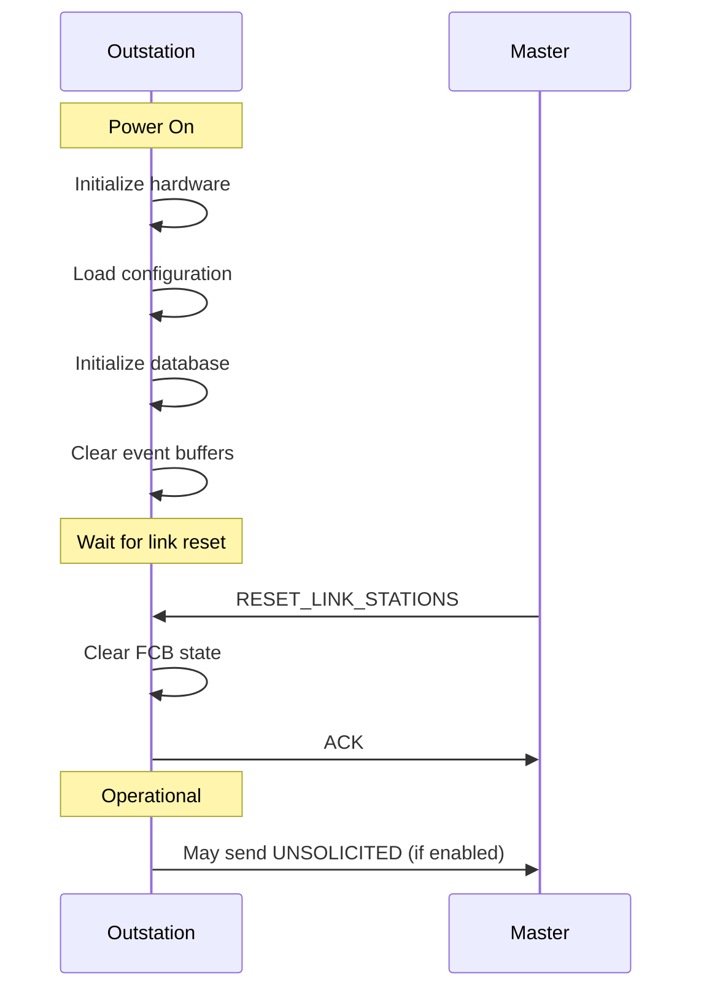

# What is a DNP3 Outstation?

## Purpose

A DNP3 **Outstation** (also called RTU, IED, or Remote Device) is a field device that collects data, responds to master requests, and executes control commands. It is the data source and control target in a DNP3 system.

## Problem Being Solved

Field devices need to:

1. **Expose data** - Make measurements available to master
2. **Receive commands** - Execute control operations
3. **Generate events** - Report changes without polling
4. **Maintain state** - Track configuration and status
5. **Time stamp** - Provide accurate event times

The Outstation fulfills these requirements.

## Outstation Architecture

### Position in SCADA System

```
┌──────────────────────────────────────────────────────────────────┐
│                      MASTER STATION                               │
└──────────────────────────────────────────────────────────────────┘
                              │
                              │ DNP3 Protocol
                              ▼
┌──────────────────────────────────────────────────────────────────┐
│                        OUTSTATION (RTU)                            │
├──────────────────────────────────────────────────────────────────┤
│  ┌──────────────────────────────────────────────────────────────┐│
│  │              DNP3 OUTSTATION STACK                            ││
│  │  ┌─────────────┐ ┌─────────────┐ ┌─────────────────────┐    ││
│  │  │ Application │ │  Transport  │ │     Data Link      │    ││
│  │  │   Layer     │ │    Layer    │ │       Layer        │    ││
│  │  └─────────────┘ └─────────────┘ └─────────────────────┘    ││
│  └──────────────────────────────────────────────────────────────┘│
│                              │                                     │
│  ┌───────────────────────────┴───────────────────────────────┐   │
│  │              DATA POINTS (Database)                        │   │
│  │  Binary Inputs │ Analog Inputs │ Counters │ Outputs        │   │
│  └────────────────────────────────────────────────────────────┘   │
│                              │                                     │
│  ┌───────────────────────────┴───────────────────────────────┐   │
│  │              FIELD INTERFACES                             │   │
│  │  Digital I/O │ Analog I/O │ Serial │ Network │ etc.       │   │
│  └────────────────────────────────────────────────────────────┘   │
└──────────────────────────────────────────────────────────────────┘
```

### Outstation Components

| Component | Responsibility |
|-----------|----------------|
| **Data Link Layer** | Frame handling, addressing, CRC |
| **Transport Layer** | Fragmentation, reassembly |
| **Application Layer** | Object handling, function codes |
| **Database** | Data point storage and access |
| **Event Buffer** | Change event storage |
| **Control Handler** | Control execution |
| **Time Manager** | Clock synchronization |

## Outstation Initialization

### Startup Sequence



### Configuration Items

| Item | Description |
|------|-------------|
| Address | DNP3 address (1-65534) |
| Baud rate | For serial connections |
| Unsolicited enable | Initial unsolicited state |
| Default variations | For Variation 0 |
| Deadband values | For event generation |
| Class assignments | Event class per point |

## Data Response

### Static Data Response

When master reads static data:

```
Master ──── READ (Group 60, Variation 1) ────────► Outstation
     │       (Request all Class 0)                    │
     │                                                │
     │ ◄─── RESPONSE ─────────────────────────────────
     │       All Class 0 objects with current values
```

### Event Response

When master reads events:

```
Master ──── READ (Group 2, Events) ────────────────► Outstation
     │                                                │
     │ ◄─── RESPONSE ─────────────────────────────────
     │       Event records with timestamps
     │
     │ Outstation may clear events after read
```

## Control Handling

### SELECT-OPERATE Process

#### SELECT

```
Master ──── SELECT ────────────────────────────────► Outstation
     │       Point 5, Latched On                       │
     │                                                │
     Outstation validates:
     │ - Point exists
     │ - Not already selected
     │ - Control is safe
     │                                                │
     │ ◄─── RESPONSE ──────────────────────────────────
     │       (Code 0: Success)
     │       Point 5 now reserved for OPERATE
```

#### OPERATE

```
Master ──── OPERATE ──────────────────────────────► Outstation
     │       Point 5, Latched On                       │
     │                                                │
     Outstation checks:
     │ - Point was selected
     │ - Selection not expired
     │                                                │
     Outstation executes:
     │ - Send command to field device
     │ - Update output status
     │ - Generate events if configured                 │
     │                                                │
     │ ◄─── RESPONSE ──────────────────────────────────
     │       (Code 0: Success)
```

See [110-controls.md](110-controls.md) for detailed control operations.

## Event Generation

### Event Triggering

```
┌──────────────────────────────────────────────────────────────────┐
│                    FIELD DEVICE CHANGE                            │
└──────────────────────────────────────────────────────────────────┘
                              │
                              ▼
┌──────────────────────────────────────────────────────────────────┐
│                       EVENT DETECTION                             │
├──────────────────────────────────────────────────────────────────┤
│  Binary: State changed?                                           │
│  Analog: Change > deadband?                                      │
│  Counter: Value changed?                                          │
│  Flags: Quality changed?                                          │
└──────────────────────────────────────────────────────────────────┘
                              │
                    ┌─────────┴─────────┐
                    │ Yes               │ No
                    ▼                   ▼
            ┌───────────────┐     ┌───────────────┐
            │ GENERATE      │     │ NO EVENT      │
            │ EVENT         │     │               │
            └───────────────┘     └───────────────┘
                              │
                              ▼
            ┌───────────────────────────────────┐
            │         STORE IN BUFFER           │
            │    (With timestamp and flags)      │
            └───────────────────────────────────┘
```

See [150-events.md](150-events.md) for detailed event handling.

## Unsolicited Responses

### When to Send Unsolicited

Outstations send unsolicited responses when:

1. **Enabled** by master (Function 41)
2. **Event detected** (binary, analog, counter change)
3. **Condition met** (class threshold reached)

### Unsolicited Flow

```
┌──────────────────────────────────────────────────────────────────┐
│                    UNSOLICITED RESPONSE FLOW                      │
├──────────────────────────────────────────────────────────────────┤
│                                                                   │
│  Event Detected                                                   │
│       │                                                           │
│       ▼                                                           │
│  ┌─────────────────────────────────────┐                         │
│  │ Is unsolicited enabled for class?    │ No ──► Store, poll later│
│  └─────────────────────────────────────┘                         │
│       │ Yes                                                       │
│       ▼                                                           │
│  ┌─────────────────────────────────────┐                         │
│  │ Generate UNSOLICITED_RESPONSE       │                         │
│  │ UNS=1, CON=1                         │                         │
│  └─────────────────────────────────────┘                         │
│       │                                                           │
│       ▼                                                           │
│  ┌─────────────────────────────────────┐                         │
│  │ Send to master                       │                         │
│  │ Wait for CONFIRM                     │                         │
│  └─────────────────────────────────────┘                         │
│                                                                   │
└──────────────────────────────────────────────────────────────────┘
```

See [170-unsolicited-responses.md](170-unsolicited-responses.md) for detailed unsolicited behavior.

## Time Synchronization

Outstations participate in time synchronization:

```
Master ──── TIME_SYNC ───────────────────────────► Outstation
     │       Function 32 or 33                       │
     │       Master time included                    │
     │                                                │
     Outstation:
     │ - Extract master time
     │ - Calculate offset
     │ - Adjust internal clock
     │                                                │
     │ ◄─── RESPONSE ─────────────────────────────────
```

See [180-time-synchronization.md](180-time-synchronization.md) for detailed time sync.

## Outstation Database

The outstation database contains all data points:

### Database Organization

```
┌──────────────────────────────────────────────────────────────────┐
│                      OUTSTATION DATABASE                          │
├──────────────────────────────────────────────────────────────────┤
│                                                                   │
│  Binary Inputs (Group 1)                                          │
│  ├─ Point 0: Breaker 1 Status    [ON]    [Class 1]               │
│  ├─ Point 1: Breaker 2 Status    [OFF]   [Class 1]               │
│  └─ Point 2: Alarm Status        [OFF]   [Class 2]               │
│                                                                   │
│  Analog Inputs (Group 30)                                         │
│  ├─ Point 0: Bus Voltage       [123.4 V]  [Class 2]               │
│  ├─ Point 1: Line Current       [456.7 A]  [Class 2]              │
│  └─ Point 2: Power Factor      [0.95]     [Class 3]              │
│                                                                   │
│  Counters (Group 20)                                              │
│  ├─ Point 0: Energy Counter    [12345]    [Class 3]               │
│  └─ Point 1: Events Counter     [789]      [Class 2]               │
│                                                                   │
│  Binary Outputs (Group 10)                                         │
│  ├─ Point 0: Breaker 1 Control [OFF]     [Class 0]               │
│  └─ Point 1: Breaker 2 Control [OFF]     [Class 0]               │
│                                                                   │
└──────────────────────────────────────────────────────────────────┘
```

See [140-database.md](140-database.md) for detailed database specification.

## Internal Indication (IIN)

Every response includes IIN status:

```
┌──────────────────────────────────────────────────────────────────┐
│                    INTERNAL INDICATION (IIN)                      │
├──────────────────────────────────────────────────────────────────┤
│                                                                   │
│  IIN.1: Device Status                                             │
│  ├─ ALL_STOP: Device not operating                                │
│  ├─ BYTE_OVER: Event buffer overflow                              │
│  ├─ MEM_UNAVAIL: Memory unavailable                                │
│  ├─ CHECK_FAIL: Self-test failure                                 │
│  └─ BUSY: Device busy                                             │
│                                                                   │
│  IIN.2: Configuration Status                                       │
│  ├─ ABT_TRAN: File transfer aborted                               │
│  ├─ CFG_ERR: Configuration error                                  │
│  ├─ MEM_UNAVAILABLE: Internal memory issue                        │
│  ├─ SYN: Clock needs sync                                          │
│  └─ ENA: General enable off                                       │
│                                                                   │
└──────────────────────────────────────────────────────────────────┘
```

Masters should check IIN on every response.

## Common Mistakes

### Mistake 1: Not Handling SELECT Timeout

**Problem**: Selection held indefinitely.

**Fix**: Implement SELECT timeout (5-10 seconds). Clear selection after timeout.

### Mistake 2: Not Checking IIN

**Problem**: Ignoring device status flags.

**Fix**: Check IIN on every response. Take appropriate action on flags.

### Mistake 3: Event Buffer Overflow

**Problem**: Buffer fills, events lost.

**Fix**: Monitor buffer level. Set BYTE_OVER when full. Clear events regularly.

### Mistake 4: Wrong Variation Response

**Problem**: Variation 0 returns unexpected format.

**Fix**: Implement all required default variations. Document which are supported.

## Engineering Notes

### Resource Considerations

| Resource | Typical Size | Notes |
|----------|--------------|-------|
| Database | 1-100 KB | Depends on point count |
| Event buffer | 1-50 KB | Depends on event rate |
| Fragment buffer | 4-10 KB | For reassembly |
| Stack | 10-50 KB | Protocol overhead |

### Reliability Implications

- Outstations must be **robust** - deployed in harsh environments
- Implement **watchdog** timers
- Handle **power loss** gracefully
- Maintain **data integrity** across restarts

### Implementation Notes

1. **Database abstraction**: Hide internal representation
2. **Event generation**: Always generate with timestamps
3. **State tracking**: Track selection state, FCB state
4. **Error reporting**: Set appropriate IIN flags
5. **Configuration**: Support runtime configuration

## Relationships

- **Parent**: [030-core-concepts.md](030-core-concepts.md)
- **Related**: [120-master.md](120-master.md), [140-database.md](140-database.md), [150-events.md](150-events.md)

## References

- IEEE 1815-2012 Section 4: System Architecture
- IEEE 1815-2012 Section 7: Application Layer
- DNP3 Users Group Technical Guidelines: Outstation Implementation
