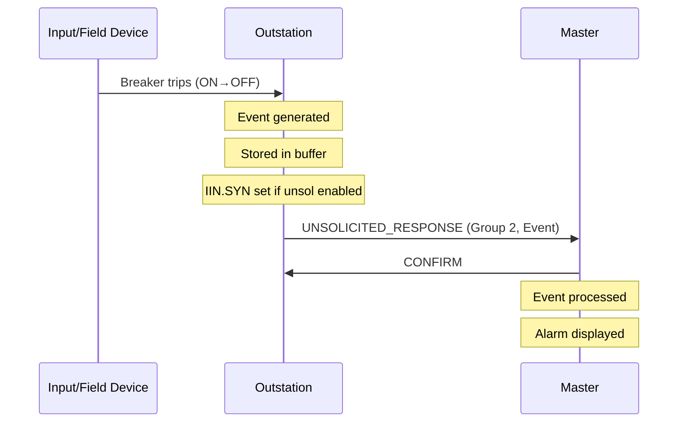

# What are DNP3 Events?

## Purpose

DNP3 events enable **efficient data reporting** by transmitting only data that has changed, rather than continuously polling all data. This dramatically reduces bandwidth usage while ensuring timely notification of important changes.

## Problem Being Solved

Continuous polling has problems:

1. **Inefficient** - Most data hasn't changed, wasting bandwidth
2. **Slow response** - Changes aren't reported until next poll
3. **High latency** - Critical events delayed by poll interval
4. **Scale poorly** - More points = more poll traffic

Events solve this by detecting and reporting changes immediately.

## Event Concept

An **event** is a record of a data change:

```
┌──────────────────────────────────────────────────────────────────┐
│                        EVENT RECORD                               │
├──────────────────────────────────────────────────────────────────┤
│  Value │ Flags │ Timestamp │ (Variation-specific)               │
└──────────────────────────────────────────────────────────────────┘
```

Each event captures:
- **What changed** - The new value
- **When it changed** - Timestamp
- **Quality** - Flags at time of change
- **How it changed** - Value delta or absolute

## Event Generation

### When Events Are Generated

Events are generated when:

1. **Binary input changes** - ON to OFF or OFF to ON
2. **Analog exceeds deadband** - Change exceeds configured threshold
3. **Counter changes** - New count differs from last
4. **Quality changes** - Flags change state (e.g., ONLINE to COMM_LOST)
5. **Double-bit changes** - State transition detected

### Deadband Monitoring (Analog)

```
                    ┌──── Deadband ────┐
                    │                  │
Value ──────► ──────┼──────────────────┼────────►
                    │                  │
                    ▼                  ▼
                 Trigger             Trigger
                  Low                High
```

When analog value crosses deadband boundary, an event is generated.

See [270-deadbands.md](270-deadbands.md) for detailed deadband specification.

## Event Object Groups

### Binary Event Groups

| Group | Description | Contains |
|-------|-------------|----------|
| 2 | Binary Input Event | Binary state change |
| 4 | Double-Bit Binary Event | Double-bit state change |
| 11 | Binary Output Event | Output change |
| 22 | Counter Event | Counter change |
| 23 | Frozen Counter Event | Frozen counter change |

### Analog Event Groups

| Group | Description | Contains |
|-------|-------------|----------|
| 32 | Analog Input Event | Analog value change |
| 33 | Frozen Analog Event | Frozen analog change |

## Event Variations

### Binary Event Variations (Group 2)

| Variation | Name | Content |
|-----------|------|---------|
| 1 | Without Time | Value + Flags only |
| 2 | Absolute Time | Value + Flags + Timestamp |
| 3 | Relative Time | Value + Flags + Time since sync |

### Analog Event Variations (Group 32)

| Variation | Name | Content |
|-----------|------|---------|
| 1 | 16-bit Analog | Value (16-bit) + Flags + Time |
| 2 | 32-bit Analog | Value (32-bit) + Flags + Time |
| 3 | 32-bit Float | Value (float) + Flags + Time |
| 4 | 64-bit Float | Value (double) + Flags + Time |
| 5 | 4-byte Float | Value (float) + Flags + Time |
| 6 | 8-byte Float | Value (double) + Flags + Time |

### Event with Relative Time (Variation 3)

```
┌──────────────────────────────────────────────────────────────────┐
│                   EVENT WITH RELATIVE TIME                        │
├──────────────────────────────────────────────────────────────────┤
│  Value (varies) │ Flags │ Milliseconds since last time sync     │
└──────────────────────────────────────────────────────────────────┘

Used when:
- Master and outstation have synchronized clocks
- Bandwidth is critical
- Events generated between syncs
```

## Event Buffers

Outstations store events in **event buffers**:

### Buffer Organization

```
┌──────────────────────────────────────────────────────────────────┐
│                       EVENT BUFFER                                │
├──────────────────────────────────────────────────────────────────┤
│  Event 1: Binary Input 5 → ON @ 10:15:32.123                     │
│  Event 2: Analog Input 3 → 1234.5 @ 10:15:32.456                 │
│  Event 3: Counter 2 → +1 @ 10:15:32.789                          │
│  ...                                                             │
│  [Maximum buffer size - oldest events may be lost]               │
└──────────────────────────────────────────────────────────────────┘
```

### Buffer Management

| Issue | Behavior |
|-------|----------|
| Buffer full | Oldest events discarded |
| Buffer overflow | IIN.1.BYTE_OVER flag set |
| Clear events | Event buffer cleared on read or command |

## Event Reporting

### Class-Based Event Reporting

Events are assigned to classes for prioritization:

| Class | Priority | Typical Content |
|-------|----------|-----------------|
| 1 | High | Critical alarms, breaker trips |
| 2 | Medium | Status changes, measurements |
| 3 | Low | Non-critical data |

See [160-class-polling.md](160-class-polling.md) for class assignment.

### Event Reading

#### READ with Class Qualifier

```
Function: READ
Objects:
  - Group 2, Variation 1 (Binary Events), Qualifier: 0x17 (Class 1)
  - Group 32, Variation 1 (Analog Events), Qualifier: 0x17 (Class 1)
```

### Clear Events

```
Function: WRITE
Objects:
  - Group 2, Variation 0, Qualifier 0x00 (Clear all binary events)
  - Group 32, Variation 0, Qualifier 0x00 (Clear all analog events)
```

## Unsolicited Event Reporting

Outstations can **主动上报** events without polling:

### Enable Unsolicited

```
Master ──── ENABLE_UNSOLICITED ──────────────────► Outstation
     │       Enable Classes: 1, 2, 3                 │
     │       (Outstation now sends unasked)         │
```

### Unsolicited Response

```
Outstation ──── UNSOLICITED_RESPONSE ────────────► Master
      │        Events with timestamps                │
      │        UNS=1 in Application Control          │
      │                                              │
      │ ◄─── CONFIRM ────────────────────────────────
```

See [170-unsolicited-responses.md](170-unsolicited-responses.md) for detailed unsolicited behavior.

## Sequence Diagram: Event Flow



## Event Timestamps

### Timestamp Quality

| Time Type | Precision | Sync Required | Use Case |
|-----------|-----------|---------------|----------|
| Absolute | 1 ms | Yes | Full timestamp needed |
| Relative | 1 ms | Yes | Time since sync |
| No time | None | No | Local processing only |

### Timestamp Synchronization

Events use outstation's local clock. For accurate timestamps:

1. **Time sync** must be performed ([180-time-synchronization.md](180-time-synchronization.md))
2. **Clock quality** affects timestamp accuracy
3. **Sync interval** affects relative timestamp accuracy

## Event Buffer Sizing

### Factors Affecting Buffer Size

| Factor | Impact |
|--------|--------|
| Number of event-enabled points | More points = more events |
| Event rate | High-activity points fill buffer faster |
| Deadband settings | Tight deadbands = more events |
| Poll interval | Longer poll = more events accumulated |
| Buffer clear frequency | How often events are read |

### Buffer Overflow Handling

```
Buffer fills ──► Oldest events lost ──► BYTE_OVER flag set
                                        (Master must poll quickly)
```

## Common Misconceptions

### Misconception 1: "Events are sent immediately"

**Reality**: Events are queued. They're sent on next poll or unsolicited if enabled.

### Misconception 2: "All data should generate events"

**Reality**: Event generation has overhead. Only enable events for data that needs change notification.

### Misconception 3: "Buffer overflow means events are lost forever"

**Reality**: Events are lost only from the buffer. If the cause continues, new events will be generated.

### Misconception 4: "Unsolicited is always better"

**Reality**: Unsolicited adds overhead for enabling/disabling. Polling may be more efficient for predictable data.

## Engineering Notes

### Performance Considerations

| Scenario | Polling | Events (Unsol) |
|----------|---------|----------------|
| Low activity | Efficient | Less efficient |
| High activity | Inefficient | Efficient |
| Critical data | Delayed | Immediate |
| Network load | Predictable | Bursty |

### Bandwidth Trade-offs

- **Without events**: All data transmitted on every poll
- **With events**: Only changed data transmitted
- **Trade-off**: Event overhead vs. polling overhead

### Implementation Notes

1. **Detect changes correctly**: Compare previous value to current
2. **Apply deadbands**: Use configured deadband values
3. **Store timestamps**: Use outstation's clock at time of change
4. **Manage buffers**: Track buffer fill level, handle overflow
5. **Prioritize**: High-class events sent first

## Relationships

- **Parent**: [090-object-model.md](090-object-model.md)
- **Related**: [100-measurements.md](100-measurements.md), [160-class-polling.md](160-class-polling.md), [170-unsolicited-responses.md](170-unsolicited-responses.md), [270-deadbands.md](270-deadbands.md)

## References

- IEEE 1815-2012 Section 7.8: Event Data
- IEEE 1815-2012 Annex A: Event Object Types
- IEEE 1815-2012 Group 2: Binary Input Events
- IEEE 1815-2012 Group 32: Analog Input Events
