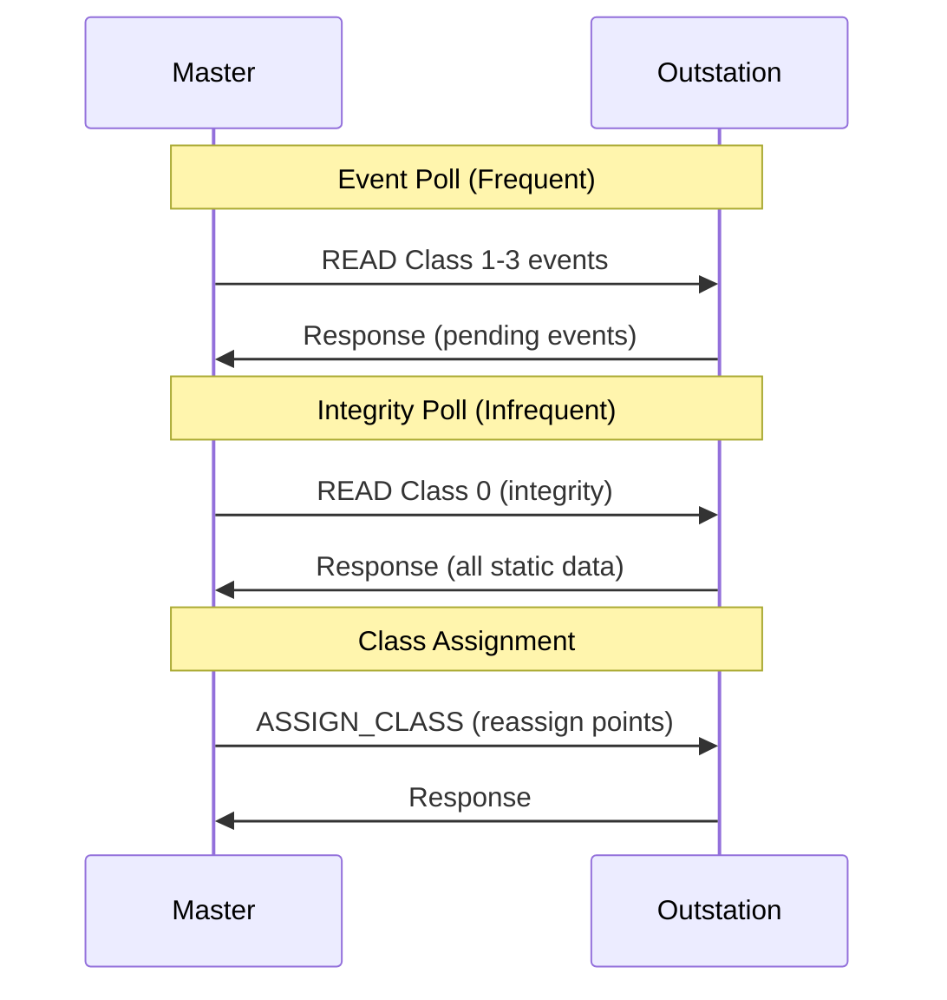

# What is DNP3 Class Polling?

## Purpose

DNP3 Class Polling provides a **prioritized data collection mechanism** that allows masters to efficiently collect data based on importance rather than polling everything equally.

## Problem Being Solved

Polling all data equally has problems:

1. **Inefficient** - Critical data mixed with non-critical
2. **Slow response** - High-priority events delayed by low-priority data
3. **Bandwidth waste** - Transmitting unchanged data

Class polling solves this by prioritizing data collection.

## Class System

### Four Classes

DNP3 defines four classes:

| Class | Name | Priority | Typical Content |
|-------|------|----------|-----------------|
| 0 | Static | Highest | Current values |
| 1 | Events | High | Critical events |
| 2 | Events | Medium | Status changes |
| 3 | Events | Low | Non-critical events |

### Class Assignment

Points are assigned to classes:

```
┌──────────────────────────────────────────────────────────────────┐
│                    CLASS ASSIGNMENT                               │
├──────────────────────────────────────────────────────────────────┤
│                                                                   │
│  Class 0 (Static): All points with current values                │
│  ├─ Binary Input 0-9  (Breaker status)                          │
│  ├─ Analog Input 0-9 (Measurements)                             │
│  └─ Counter 0-9     (Accumulators)                              │
│                                                                   │
│  Class 1 (High): Critical events                                │
│  ├─ Breaker trip events                                          │
│  └─ Protection alarms                                            │
│                                                                   │
│  Class 2 (Medium): Status changes                                │
│  ├─ Breaker position changes                                      │
│  └─ Measurement out-of-range                                      │
│                                                                   │
│  Class 3 (Low): Non-critical events                              │
│  └─ Energy pulses                                                │
│                                                                   │
└──────────────────────────────────────────────────────────────────┘
```

## Class Polling Commands

### Read All Classes

```
Function: READ
Objects:
  - Group 60, Variation 1 (All Classes 0-3)
```

### Read Specific Class

Use qualifier prefix with class number:

| Qualifier | Class |
|-----------|-------|
| 0x17 | Class 1 |
| 0x27 | Class 2 |
| 0x37 | Class 3 |

### Example: Read Class 1 Events Only

```
Function: READ
Objects:
  - Group 2 (Binary Events), Variation 1, Qualifier: 0x17 (Class 1)
  - Group 32 (Analog Events), Variation 1, Qualifier: 0x17 (Class 1)
```

## Polling Patterns

### Pattern 1: All Classes Poll

```
Master ──── READ (Group 60, Var 1) ──────────────────► Outstation
     │       (Classes 0, 1, 2, 3)                        │
     │ ◄─── RESPONSE ─────────────────────────────────────
     │       (All data)
```

### Pattern 2: Event Poll (Classes 1-3)

```
Master ──── READ ───────────────────────────────────► Outstation
     │       Group 2, Var 1, Qualifier 0x17 (Class 1)       │
     │       Group 32, Var 1, Qualifier 0x17 (Class 1)      │
     │       Group 22, Var 1, Qualifier 0x17 (Class 1)      │
     │       Group 2, Var 1, Qualifier 0x27 (Class 2)       │
     │       Group 32, Var 1, Qualifier 0x27 (Class 2)      │
     │       Group 22, Var 1, Qualifier 0x27 (Class 2)      │
     │       Group 2, Var 1, Qualifier 0x37 (Class 3)       │
     │       Group 32, Var 1, Qualifier 0x37 (Class 3)      │
     │       Group 22, Var 1, Qualifier 0x37 (Class 3)      │
     │ ◄─── RESPONSE ─────────────────────────────────────
     │       (All pending events, grouped by class)
```

### Pattern 3: Class 0 Only (Integrity Poll)

```
Master ──── READ ───────────────────────────────────► Outstation
     │       Group 60, Variation 1 (Class 0)               │
     │ ◄─── RESPONSE ─────────────────────────────────────
     │       (All static data)
```

## Assign Class Command

### Function 48: Assign Class

Masters assign points to classes:

```
Function: ASSIGN_CLASS
Objects:
  - Group 1, Variation 1, Qualifier 0x05, Index 0, Count 10
    → Points 0-9 assigned to Class 1
```

### Class Assignment Ranges

| Qualifier | Format | Description |
|-----------|--------|-------------|
| 0x00 | All | Assign all points to class |
| 0x05 | Index + Count | Assign range to class |
| 0x06 | 16-bit Index + Count | Assign large range |

## Polling Schedule

### Typical Schedule

| Poll Type | Frequency | Data |
|-----------|-----------|------|
| Class 0 | Hourly/Daily | Integrity check |
| Class 1 | 1-5 seconds | Critical events |
| Class 2 | 5-30 seconds | Medium priority |
| Class 3 | 30-60 seconds | Low priority |

### Adaptive Polling

Masters can adapt poll frequency:

```
If Class 1 event rate increases:
    → Increase Class 1 poll frequency
    → May decrease Class 2/3 frequency

If no Class 1 events:
    → Can reduce Class 1 poll
    → Focus on Classes 2/3
```

## Class vs. Priority

### Clarification

- **Class**: DNP3 protocol grouping (0, 1, 2, 3)
- **Priority**: Implementation-specific urgency level

Classes provide a standardized way to categorize data. Priority handling is implementation-defined.

## Sequence Diagram: Class Polling



## Common Misconceptions

### Misconception 1: "Class 0 has no events"

**Reality**: Class 0 is static data, but points can also generate Class 1-3 events.

### Misconception 2: "Must poll all classes"

**Reality**: Masters choose which classes to poll based on needs.

### Misconception 3: "Classes are data types"

**Reality**: Classes are priority groupings. Binary and analog can be any class.

## Engineering Notes

### Performance Optimization

| Strategy | Benefit |
|----------|---------|
| Frequent Class 1 polls | Fast critical response |
| Batch classes in one poll | Reduce messages |
| Separate polls by class | Flexible timing |
| Unsolicited for Class 1 | No polling needed |

### Bandwidth Optimization

```
Without class polling:
  Poll interval: 10 seconds
  Data per poll: 1000 bytes
  Bandwidth: 100 bytes/sec

With class polling:
  Class 1: 2 seconds, 100 bytes
  Class 2: 10 seconds, 200 bytes
  Class 0: 60 minutes, 1000 bytes
  Average: ~50 bytes/sec (50% reduction)
```

## Relationships

- **Parent**: [090-object-model.md](090-object-model.md)
- **Related**: [150-events.md](150-events.md), [170-unsolicited-responses.md](170-unsolicited-responses.md)

## References

- IEEE 1815-2012 Section 7.9: Class Polling
- IEEE 1815-2012 Function 48: Assign Class
- IEEE 1815-2012 Group 60: Class Data
