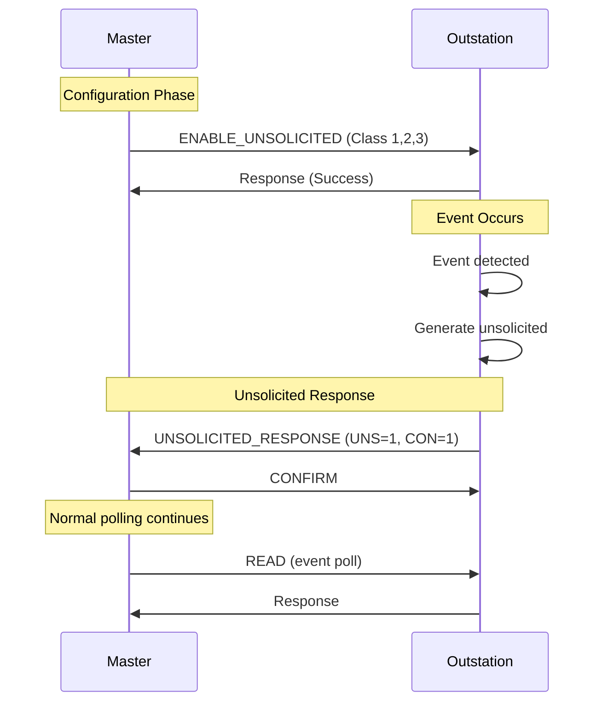

# What are DNP3 Unsolicited Responses?

## Purpose

DNP3 Unsolicited Responses allow outstations to **主动上报** data to masters without waiting for a poll. This enables immediate notification of important events.

## Problem Being Solved

Polling-only systems have limitations:

1. **Latency** - Events wait until next poll
2. **Inefficiency** - Poll traffic even when nothing changed
3. **Missed events** - Fast events may be overwritten before poll

Unsolicited responses solve these by enabling event-driven communication.

## Unsolicited Concept

### Definition

An **unsolicited response** is a response sent by an outstation **without first receiving a request** from the master.

### Trigger

Unsolicited responses are triggered by:
1. **Event generation** (when unsolicited is enabled)
2. **IIN flag changes** (device status changes)
3. **Startup/restart** (device comes online)

## Enable/Disable Commands

### Function 41: Enable Unsolicited

```
Master ──── ENABLE_UNSOLICITED ────────────────────► Outstation
     │       Classes: 1, 2, 3                           │
     │       (Enable for selected classes)              │
     │ ◄─── RESPONSE ────────────────────────────────────
```

### Function 42: Disable Unsolicited

```
Master ──── DISABLE_UNSOLICITED ───────────────────► Outstation
     │       Classes: 1, 2, 3                           │
     │       (Disable for selected classes)              │
     │ ◄─── RESPONSE ────────────────────────────────────
```

### Enable/Disable Objects

| Group | Variation | Classes Affected |
|-------|-----------|------------------|
| 60 | Variation 2 | All (binary, analog, counter) |
| 60 | Variation 3 | Binary events |
| 60 | Variation 4 | Analog events |
| 60 | Variation 5 | Counter events |

## Unsolicited Response Format

### Application Control

The **UNS bit** in Application Control indicates unsolicited:

```
┌────────┬────────┬────────┬────────┬──────────────────────────────┐
│  FIR   │  FIN   │  CON   │  UNS   │       Sequence              │
│   1    │   1    │   1    │   1    │          N                   │
└────────┴────────┴────────┴────────┴──────────────────────────────┘
```

| Field | Value | Meaning |
|-------|-------|---------|
| UNS | 1 | Unsolicited response |
| CON | 1 | Confirmation required |

## Sequence Diagram



## Startup Unsolicited

### Function 3: Cold Restart

After cold restart, outstation may send unsolicited:

```
Outstation ──── UNSOLICITED_RESPONSE ───────────────► Master
      │        (IIN.RST flag set)                      │
      │        (Indicates restart occurred)             │
      │                                                  │
      │ ◄─── CONFIRM ────────────────────────────────────
```

### Function 4: Warm Restart

Similar to cold restart, with IIN flag indicating restart type.

## Confirmation Requirements

### CON=1 Responses

When UNS=1 and CON=1:

```
Outstation ──── UNSOLICITED ─────────────────────────► Master
     │       (CON=1)                                      │
     │                                                      │
     │ ◄─── CONFIRM ────────────────────────────────────────
     │       (Master must confirm)
```

### What Happens Without Confirmation

If confirmation not received within timeout:

```
Outstation:
1. Wait for confirmation timeout (typically 5-10 seconds)
2. Retry unsolicited (retry count configurable)
3. After max retries, may set error flag
```

## Response Behavior

### After Receiving Unsolicited

Masters should:

1. **Confirm immediately** - Send CONFIRM
2. **Process events** - Integrate into database
3. **Check IIN** - Verify device status
4. **Clear events** - Optionally read to clear buffer

### Event Buffer Interaction

```
Unsolicited sent ──► Events marked as sent
                    (May still be in buffer)

Event poll ──────────► Only NEW events returned
                      (Events already sent not repeated)
```

## Class-Based Unsolicited

### Enable Specific Classes

```
Master ──── ENABLE_UNSOLICITED ────────────────────► Outstation
     │       - Group 2 (Binary) → Class 1                │
     │       - Group 32 (Analog) → Class 2             │
     │       (Only Class 1/2 events sent unsolicited)   │
```

### Disable Specific Classes

```
Master ──── DISABLE_UNSOLICITED ───────────────────► Outstation
     │       - Group 2 (Binary) → Class 1                │
     │       (Class 1 no longer unsolicited)             │
```

## Common Mistakes

### Mistake 1: Not Enabling Unsolicited

**Problem**: Outstation never sends unsolicited.

**Fix**: Master must send ENABLE_UNSOLICITED before outstation sends.

### Mistake 2: Not Confirming Unsolicited

**Problem**: Outstation retries indefinitely.

**Fix**: Always confirm UNS responses with CON=1.

### Mistake 3: Ignoring IIN Flags

**Problem**: Restart indication missed.

**Fix**: Check IIN.RST on first unsolicited after connection.

### Mistake 4: Assuming All Events Unsolicited

**Problem**: Events not sent if unsolicited not enabled.

**Fix**: Always poll for events as backup.

## Engineering Notes

### Performance Trade-offs

| Aspect | Poll Only | Unsolicited |
|--------|-----------|-------------|
| Latency | Poll interval | Immediate |
| Traffic | Fixed | Bursty |
| Complexity | Simple | More complex |
| Reliability | Master controls | Dependent on network |

### When to Use Unsolicited

| Scenario | Recommendation |
|----------|-----------------|
| Critical alarms | Use unsolicited (Class 1) |
| Non-critical data | Poll only |
| High event rates | Use unsolicited |
| Low-bandwidth link | Poll only |
| SCADA integration | Use unsolicited |

### Implementation Notes

1. **Track enabled state**: Don't send if not enabled
2. **Confirm timeout**: Implement retry mechanism
3. **Buffer management**: Events marked sent but not cleared
4. **IIN tracking**: Set SYN flag after enable if time sync needed

## Relationships

- **Parent**: [150-events.md](150-events.md)
- **Related**: [160-class-polling.md](160-class-polling.md), [190-confirmations.md](190-confirmations.md)

## References

- IEEE 1815-2012 Section 7.10: Unsolicited Responses
- IEEE 1815-2012 Function 41: Enable Unsolicited
- IEEE 1815-2012 Function 42: Disable Unsolicited
