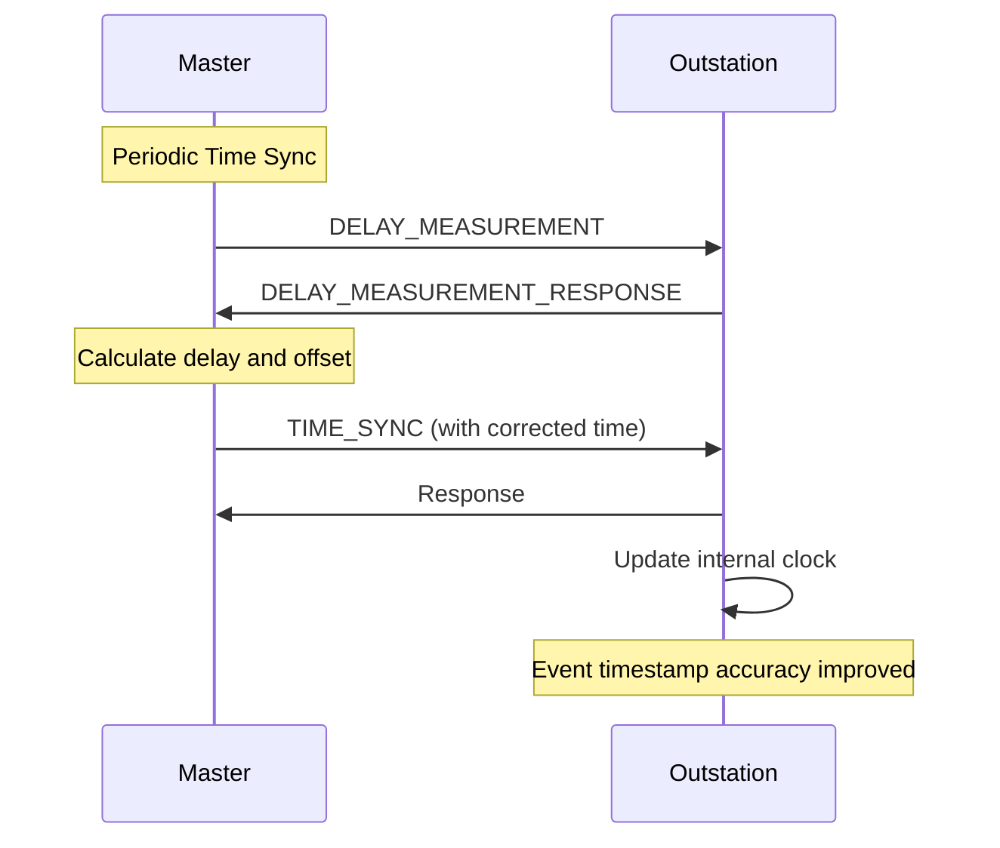

# What is DNP3 Time Synchronization?

## Purpose

DNP3 Time Synchronization ensures that outstation clocks are **accurately synchronized** with the master station, enabling consistent timestamps across all devices.

## Problem Being Solved

Outstation clocks drift:

1. **Crystal tolerance** - Clocks vary ±50-100 ppm
2. **Temperature effects** - Clock rate changes with temperature
3. **No absolute reference** - Each device has independent time
4. **Event accuracy** - Timestamps must be consistent

Time synchronization solves these issues.

## Time Representation

### DNP3 Time Format

DNP3 uses a proprietary time format:

```
┌──────────────────────────────────────────────────────────────────┐
│                    TIME AND DATE (6 bytes)                        │
├──────────────────────────────────────────────────────────────────┤
│  Milliseconds (2 B) │ Days since Jan 1, 1980 (2 B) │             │
│  0-86399999 ms      │ 0-65535 (179 years)         │             │
├──────────────────────────────────────────────────────────────────┤
│  Hours │  Minutes │ Seconds │ Day │  Month  │ Year │              │
│  5 bits│  6 bits  │ 5 bits  │3 bit│  4 bits │7 bit│             │
│  0-23  │   0-59   │  0-59   │1-7  │  1-12   │ 0-99 │            │
└──────────────────────────────────────────────────────────────────┘
```

### Time Range

| Aspect | Value |
|--------|-------|
| Start date | January 1, 1980 |
| Millisecond precision | 1 ms |
| Day range | 0-65,535 (179 years) |
| Maximum time | ~January 1, 2159 |

### Alternative Time Formats

| Group | Variation | Format |
|-------|-----------|--------|
| 50 | 1 | Time and Date |
| 50 | 2 | Time and Date with Quality |
| 51 | 1 | Long Absolute Time |
| 51 | 2 | Long Absolute Time with Quality |
| 52 | 1 | Unsynchronized Time |

## Time Synchronization Methods

### Method 1: Delay Measurement (Function 51)

Most accurate method, measures round-trip delay:

```mermaid
sequenceDiagram
    participant Mast as Master
    participant Out as Outstation

    Mast->>Out: DELAY_MEASUREMENT_REQUEST
    Note over Mast: t1 = send time
    Out->>Out: Process request
    Out->>Mast: DELAY_MEASUREMENT_RESPONSE
    Note over Mast: t4 = receive time, t3 = response time

    Master calculates:
    Round-trip time = t4 - t1
    Processing delay = (t4 - t1 - (t3 - t2)) / 2
    Master time = (t2 + t3) / 2 + processing delay
```

### Method 2: Time Synchronization (Function 32)

Simple time broadcast:

```
Master ──── TIME_SYNC ─────────────────────────────► Outstation
     │       Function 32                              │
     │       Time: [Current master time]              │
     │                                                  │
     Outstation:
     │ - Set clock to received time
     │ - Record offset for future adjustments
     │                                                  │
     │ ◄─── RESPONSE ──────────────────────────────────
```

### Method 3: Clock Synchronization Broadcast (Function 59)

Uncoordinated broadcast:

```
Master ──── CLOCK_SYNC ─────────────────────────────► Outstation
     │       Function 59 (Broadcast address 0xFFFF)   │
     │       Time: [Current master time]               │
     │       (No response expected)                    │
```

## Time Offset Calculation

### Offset Determination

Outstations calculate time offset:

```
┌──────────────────────────────────────────────────────────────────┐
│                    TIME OFFSET CALCULATION                         │
├──────────────────────────────────────────────────────────────────┤
│                                                                   │
│  Master sends: T_master                                          │
│  Outstation receives: T_received                                 │
│  Actual master time at receive: T_master + (T_received - T_sent)  │
│                                                                   │
│  Offset = T_received - T_master                                  │
│                                                                   │
│  Outstation applies: T_actual = T_internal - Offset               │
│                                                                   │
└──────────────────────────────────────────────────────────────────┘
```

### Latency Compensation

| Factor | Impact | Compensation |
|--------|--------|--------------|
| Network latency | Asymmetric delays | Delay measurement |
| Outstation processing | Variable delay | Measured or estimated |
| Master processing | Variable delay | Measured or ignored |
| Propagation delay | Small for LAN | Ignored |

## Synchronization Interval

### Recommended Intervals

| Network Type | Interval | Notes |
|--------------|----------|-------|
| LAN | 1-15 minutes | Stable, low latency |
| WAN | 1-5 minutes | Variable latency |
| Serial | 5-15 minutes | Slow link |
| Critical apps | 1 minute | Maximum accuracy |

### Drift Analysis

```
Clock drift rate: ±50 ppm (typical)

After 1 minute:  ±3 ms
After 15 minutes: ±45 ms
After 1 hour:    ±180 ms
After 1 day:     ±4.3 seconds
```

## Time Quality

### Quality Indicators

| Indicator | Meaning |
|-----------|---------|
| IIN.SYN | Clock needs synchronization |
| Time Valid | Time is within expected range |
| Leap Second Pending | Leap second will occur |

### IIN.SYN Flag

Outstations set IIN.SYN when:

1. Clock not synchronized
2. Synchronization timeout exceeded
3. Manual time set

Masters should synchronize when IIN.SYN detected.

## Sequence Diagram: Time Sync Process



## Unsolicited and Time Sync

### Unsolicited Response Timestamps

Events use outstation's local clock:

```
Event occurs
    │
    ▼
Outstation timestamps with local clock
    │
    ▼
Time synchronized with master
    │
    ▼
Future events have accurate timestamps
    │
    ▼
Older events retain original (unsynchronized) timestamps
```

### Impact on Event Timestamps

| Event Time | Timestamp Accuracy |
|------------|-------------------|
| Before sync | ±drift since last sync |
| After sync | ±1 ms (if delay measured) |

## Common Mistakes

### Mistake 1: Ignoring IIN.SYN

**Problem**: Clock drift not corrected.

**Fix**: Check IIN.SYN on responses. Trigger sync when set.

### Mistake 2: Wrong Sync Method

**Problem**: Delay measurement vs. simple sync confusion.

**Fix**: Use delay measurement for accuracy. Simple sync for broadcast.

### Mistake 3: Not Compensating Latency

**Problem**: Timestamp errors due to latency.

**Fix**: Use delay measurement for precise time.

### Mistake 4: Sync Too Infrequent

**Problem**: Clock drift causes timestamp errors.

**Fix**: Sync frequently enough for required accuracy.

## Engineering Notes

### Accuracy Requirements

| Application | Accuracy Needed |
|-------------|-----------------|
| Event ordering | 10-100 ms |
| Fault recording | 1-10 ms |
| Billing (energy) | 1 second |
| Sequence of events | 1 ms |

### Performance Implications

| Sync Method | Accuracy | Bandwidth |
|-------------|----------|-----------|
| Simple broadcast | ±100 ms | Low |
| Time sync (F32) | ±10 ms | Low |
| Delay measure (F51) | ±1 ms | Medium |

### Implementation Notes

1. **Track last sync**: Know when sync occurred
2. **Calculate drift**: Track clock rate deviation
3. **Handle time jumps**: Apply offset smoothly
4. **Log sync events**: Record for troubleshooting

## Relationships

- **Related**: [150-events.md](150-events.md), [080-application-layer.md](080-application-layer.md)

## References

- IEEE 1815-2012 Section 7.11: Time Synchronization
- IEEE 1815-2012 Function 32: Time and Date
- IEEE 1815-2012 Function 51: Delay Measurement
- IEEE 1815-2012 Function 59: Clock Synchronization Broadcast
