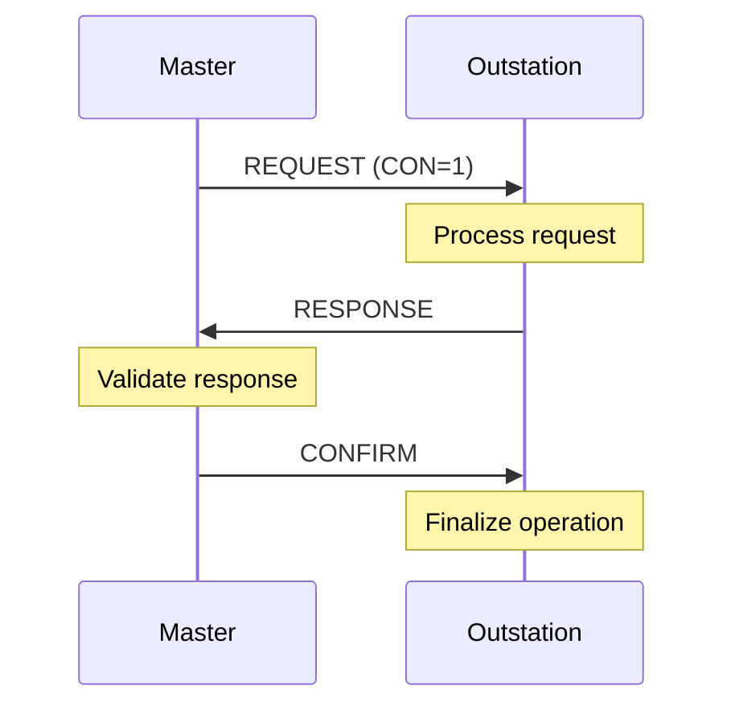
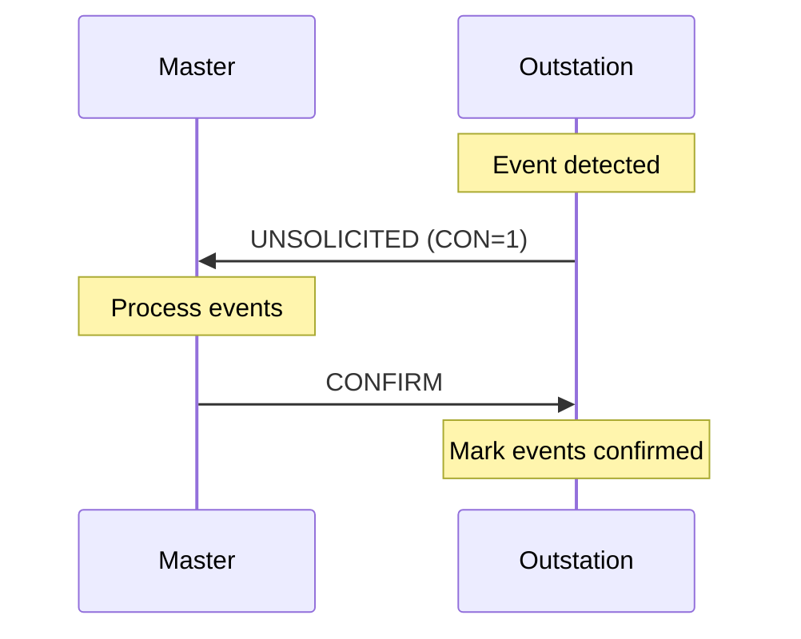

# What are DNP3 Confirmations?

## Purpose

DNP3 Confirmations provide **application-level reliability** by requiring explicit acknowledgment of critical operations. They ensure messages are received and processed correctly.

## Problem Being Solved

Lower layers (Data Link) provide basic reliability. Confirmations provide:

1. **End-to-end verification** - Application layer receipt confirmed
2. **Operation acknowledgment** - Critical operations verified
3. **Retry coordination** - Failed operations retried
4. **State synchronization** - Both sides agree on state

## Confirmation Levels

### Level 1: Data Link Confirmation

Handled at Data Link layer using FCB.

See [220-fcb.md](220-fcb.md) for Data Link confirmation.

### Level 2: Application Confirmation

Handled at Application layer using CON bit.

## Application Confirmation

### CON Bit in Application Control

```
┌────────┬────────┬────────┬────────┬──────────────────────────────┐
│  FIR   │  FIN   │  CON   │  UNS   │       Sequence               │
│   1    │   1    │   1    │   0    │          N                   │
└────────┴────────┴────────┴────────┴──────────────────────────────┘
                      ↑
                      │
                Requires confirmation
```

| CON Value | Meaning |
|-----------|---------|
| 0 | No confirmation required |
| 1 | Confirmation required |

## When CON=1

### Master Requests with CON=1

Used for critical operations:

- Control commands
- Configuration changes
- Important writes

```
Master ──── REQUEST (CON=1) ───────────────────────► Outstation
     │       Critical operation                           │
     │ ◄─── RESPONSE ──────────────────────────────────────
     │       (Result of operation)                         │
     │ ◄─── CONFIRM ────────────────────────────────────────
     │       (Master confirms receipt)                     │
```

### Unsolicited with CON=1

Unsolicited responses always use CON=1:

```
Outstation ──── UNSOLICITED (CON=1) ───────────────► Master
      │       Event data                                    │
      │ ◄─── CONFIRM ────────────────────────────────────────
      │       (Master confirms receipt)                     │
```

## CONFIRM Function Code

### Function 1: CONFIRM

```
┌──────────────────────────────────────────────────────────────────┐
│                        CONFIRM PDU                                │
├──────────────────────────────────────────────────────────────────┤
│  Application Control │ Function Code = 1 │ (No Objects)        │
│  (FIR=1, FIN=1, CON=0)│ CONFIRM           │                      │
└──────────────────────────────────────────────────────────────────┘
```

The CONFIRM function has no objects - it's just the function code.

## Confirmation Sequence

### Solicited Confirmation



### Unsolicited Confirmation



## Timeout Behavior

### Master Timeout

If response not received:

```
Master ──── REQUEST (CON=1) ───────────────────────►
     │ (Wait for RESPONSE)
     │
     │ X (Timeout - no response)
     │
     │ Retry REQUEST (CON=1)
```

### Confirmation Timeout

If CONFIRM not received by outstation:

```
Outstation ──── RESPONSE ───────────────────────────► Master
     │ (Wait for CONFIRM)
     │
     │ X (Timeout - no confirm)
     │
     │ Outstation may:
     │ - Retry RESPONSE
     │ - Set error flag
     │ - Log warning
```

## Retry Behavior

### Master Retry

Masters retry requests on timeout:

```
Attempt 1: ──── REQUEST ─────────────────────────────►
Timeout
Attempt 2: ──── REQUEST ─────────────────────────────►
Timeout
Attempt 3: ──── REQUEST ─────────────────────────────►
Response received
```

### Retry Limits

| Parameter | Typical Value | Description |
|-----------|---------------|-------------|
| Retry count | 3-5 | Maximum retries |
| Timeout | 5-10 seconds | Per-attempt timeout |
| Total timeout | 30-60 seconds | Abandon after total |

## When NOT to Use CON=1

### Read Operations

Read operations typically don't require CON=1:

```
Master ──── READ (CON=0) ───────────────────────────►
     │ ◄─── RESPONSE ─────────────────────────────────
     │       (No CONFIRM required)
```

Reason: If response is lost, master polls again.

### Non-Critical Writes

Non-critical writes may skip CON=1:

```
Master ──── WRITE (CON=0) ──────────────────────────►
     │ ◄─── RESPONSE ─────────────────────────────────
```

Reason: Data will be refreshed on next poll.

## State Management

### Outstation State on CONFIRM

```
┌──────────────────────────────────────────────────────────────────┐
│                 OUTSTATION CONFIRMATION STATE                     │
├──────────────────────────────────────────────────────────────────┤
│                                                                   │
│  Received RESPONSE:                                              │
│  ├─ Store response data                                          │
│  ├─ Wait for CONFIRM                                             │
│  └─ Start confirm timeout                                        │
│                                                                   │
│  Received CONFIRM:                                               │
│  ├─ Finalize operation                                            │
│  ├─ Clear confirm timeout                                         │
│  └─ Clear stored response                                         │
│                                                                   │
│  Confirm timeout:                                                 │
│  ├─ Log warning                                                   │
│  └─ May retain or discard response                                │
│                                                                   │
└──────────────────────────────────────────────────────────────────┘
```

## Common Mistakes

### Mistake 1: Never Using CON=1

**Problem**: Controls not verified.

**Fix**: Use CON=1 for critical operations.

### Mistake 2: Using CON=1 on All Requests

**Problem**: Unnecessary traffic and latency.

**Fix**: Only use CON=1 when needed.

### Mistake 3: Not Implementing Confirm Timeout

**Problem**: Stale responses held indefinitely.

**Fix**: Implement timeout, clear old responses.

### Mistake 4: Confusing Data Link and Application Confirmation

**Problem**: Using wrong confirmation mechanism.

**Fix**: Data Link: FCB. Application: CON bit.

## Engineering Notes

### Performance Trade-offs

| CON Setting | Latency | Reliability | Traffic |
|-------------|---------|-------------|---------|
| CON=0 | Lower | Lower | Lower |
| CON=1 | Higher | Higher | Higher |

### Implementation Notes

1. **Track pending confirms**: Don't send duplicate responses
2. **Implement timeouts**: Clear stale confirmations
3. **Distinguish from DL confirmation**: Separate mechanisms
4. **Log confirm failures**: For troubleshooting

## Relationships

- **Parent**: [080-application-layer.md](080-application-layer.md)
- **Related**: [220-fcb.md](220-fcb.md), [060-link-layer.md](060-link-layer.md)

## References

- IEEE 1815-2012 Section 7.4: Confirmation
- IEEE 1815-2012 Function 1: Confirm
- IEEE 1815-2012 Section 5: Data Link Confirmation
