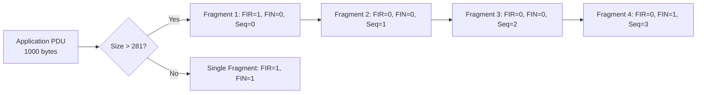

# What is DNP3 Fragmentation?

## Purpose

DNP3 Fragmentation enables **large messages** by breaking Application PDUs into multiple Data Link frames and reassembling them on reception.

## Problem Being Solved

Data Link frames have limited size (~292 bytes of user data). Application messages can be much larger.

Fragmentation solves this by:
1. Breaking large messages
2. Transmitting in multiple frames
3. Reassembling at destination

## Fragmentation Overview

### Size Limits

| Layer | Maximum Size |
|-------|-------------|
| Data Link frame | 292 bytes (data) |
| Transport fragment | 281 bytes (data) |
| Application PDU | Unlimited (fragmented) |

### When Fragmentation Occurs

```
Application PDU size > 281 bytes → Fragmentation required
Application PDU size ≤ 281 bytes → Single fragment
```

## Transport Header

Each fragment has a 1-byte transport header:

```
┌────────┬────────┬──────────────────────────────┐
│  FIR   │  FIN   │       Sequence Number       │
│  1 bit │  1 bit │          6 bits             │
└────────┴────────┴──────────────────────────────┘
```

### FIR (First Fragment)

- 1 = First fragment of message
- 0 = Subsequent fragment

### FIN (Final Fragment)

- 1 = Final fragment of message
- 0 = More fragments follow

### Sequence Number

- 0-63 (6 bits)
- Increments for each fragment
- Used to detect missing fragments

## Fragment Types

### Single Fragment Message

```
FIR=1, FIN=1, Seq=N

┌─────────────────────────────────────────────────────┐
│ Fragment: [FIR=1, FIN=1, Seq=N] + Data             │
└─────────────────────────────────────────────────────┘

Complete PDU in one fragment
```

### Multi-Fragment Message

```
Fragment 1: FIR=1, FIN=0, Seq=0 + Data[0:281]
Fragment 2: FIR=0, FIN=0, Seq=1 + Data[281:562]
Fragment 3: FIR=0, FIN=1, Seq=2 + Data[562:843]
```

## Fragmentation Process

### Sending (Fragmentation)



### Receiving (Reassembly)

```
┌─────────────────────────────────────────────────────┐
│                 RECONSTRUCTION BUFFER               │
├─────────────────────────────────────────────────────┤
│  Fragment 1 (FIR=1, Seq=0) → [Offset 0]             │
│  Fragment 2 (FIR=0, Seq=1) → [Offset 281]           │
│  Fragment 3 (FIR=0, Seq=2) → [Offset 562]           │
│  Fragment 4 (FIR=0, FIN=1, Seq=3) → [Offset 843]    │
│                                                      │
│  Complete PDU: 1000 bytes                           │
└─────────────────────────────────────────────────────┘
```

## Reassembly Rules

### Valid Sequence

| Received | Expected | Action |
|----------|----------|--------|
| FIR=1 | (any) | Start new message |
| Seq=N | Expected | Append data |
| Seq≠Expected | - | Error - gap detected |
| FIN=1 | (any) | Message complete |
| Duplicate | - | Discard duplicate |

### Error Handling

```
Gap detected:
  1. Discard partial message
  2. Request retransmission (application level)
  3. Reset reassembly state

Timeout:
  1. Discard partial message
  2. Log error
  3. Request retransmission
```

## Timeout Behavior

### Reassembly Timeout

If fragments don't complete:

| Timeout | Action |
|---------|--------|
| 5-10 seconds | Discard partial |
| Log | Record event |
| Retry | Request retransmission |

## Maximum Message Size

### Size Calculation

```
Data Link frame: 292 bytes max
  - 10 bytes overhead (header + CRC)
  - 282 bytes data

Transport header: 1 byte
  - 281 bytes user data per fragment

For N fragments:
  Maximum PDU = N × 281 bytes
```

### Practical Limits

| Fragments | Maximum PDU Size |
|-----------|-----------------|
| 1 | 281 bytes |
| 10 | 2,810 bytes |
| 100 | 28,100 bytes |
| 1000 | 281,000 bytes |

Typical SCADA messages are < 4 KB.

## Fragment Sequence Numbers

### Increment Rules

- Sequence starts at any value (typically 0)
- Increments by 1 for each fragment
- Wraps from 63 to 0
- Independent in each direction

### Sequence Number Scope

```
Session Start:
  Transmit Seq = 0
  Receive Seq = 0

After Fragment N sent:
  Transmit Seq = (Transmit Seq + 1) % 64

On valid Fragment received:
  Receive Seq = (Receive Seq + 1) % 64
```

## Common Mistakes

### Mistake 1: Wrong FIR/FIN on Single Fragment

**Problem**: Single fragment with FIR=0 or FIN=0.

**Fix**: Single fragment MUST have FIR=1 AND FIN=1.

### Mistake 2: Not Resetting Sequence on New Message

**Problem**: Sequence continues from previous message.

**Fix**: FIR=1 starts new sequence. Reset to expected.

### Mistake 3: Buffer Too Small

**Problem**: Buffer overflow on large messages.

**Fix**: Support configurable buffer sizes (4-10 KB typical).

### Mistake 4: No Reassembly Timeout

**Problem**: Partial messages held forever.

**Fix**: Implement timeout. Discard and request retry.

## Engineering Notes

### Performance Implications

| Aspect | Impact |
|--------|--------|
| Fragment overhead | 1 byte per fragment |
| Large messages | More fragments = more overhead |
| Fragment loss | Entire message must retry |
| Buffer usage | Memory proportional to message |

### Memory Requirements

```
Buffer per session = Maximum PDU size
                    = N × 281 bytes

Typical: 4-10 KB per session
```

### Implementation Notes

1. **Track state**: FIR, FIN, expected sequence
2. **Buffer management**: Pre-allocate, reuse
3. **Timeout handling**: Per-message timeout
4. **Error handling**: Clear state on errors

## Relationships

- **Parent**: [050-layer-model.md](050-layer-model.md)
- **Related**: [070-transport-layer.md](070-transport-layer.md), [210-sequence-numbers.md](210-sequence-numbers.md)

## References

- IEEE 1815-2012 Section 6: Transport Functions
- IEEE 1815-2012 Section 6.2: Segmentation
- IEEE 1815-2012 Section 6.3: Reassembly
