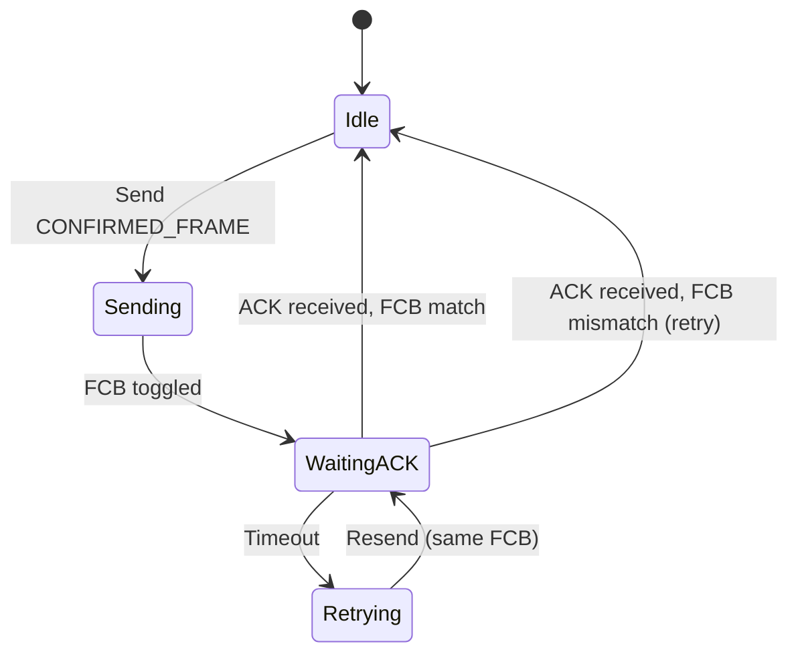
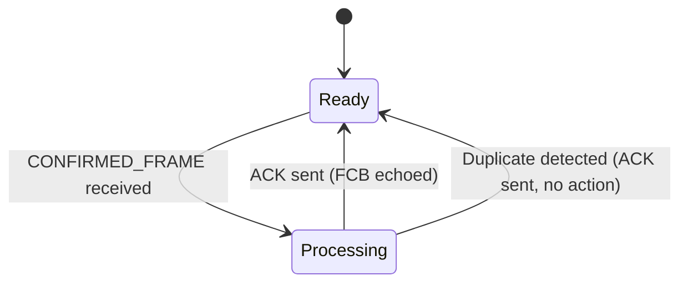
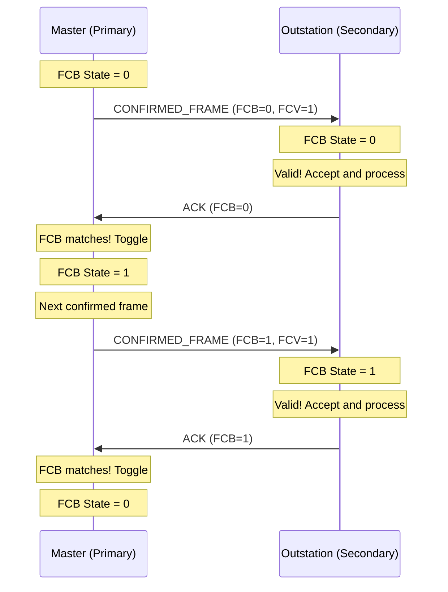
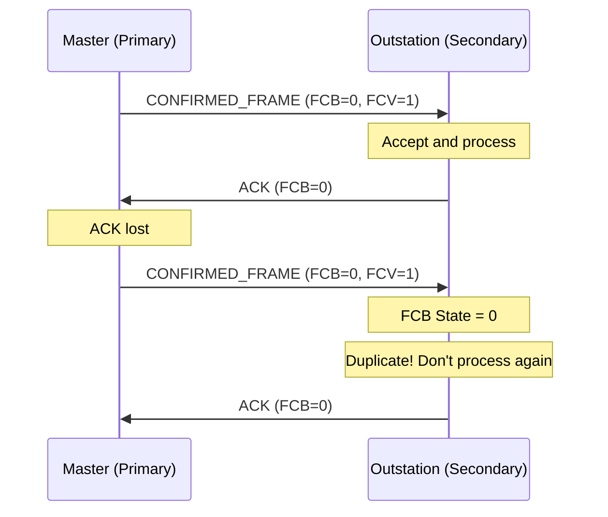
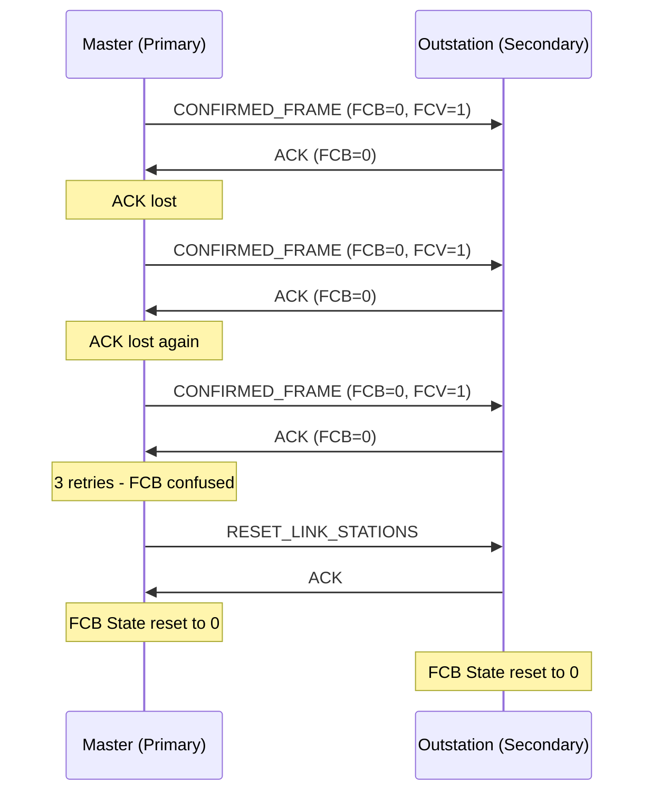

# What is DNP3 FCB (Frame Count Bit)?

## Purpose

The DNP3 **Frame Count Bit (FCB)** provides **Data Link layer confirmation** for confirmed frames. It ensures reliable delivery at the link layer.

## Problem Being Solved

The Data Link layer must ensure:

1. **Delivery confirmation** - Receiver acknowledges frame receipt
2. **Duplicate detection** - Retransmissions detected
3. **State tracking** - Both sides agree on transmission state

FCB solves these with a simple toggle bit.

## FCB Format

### Location in Control Byte

```
┌───┬───┬───────────┬───────┬──────────────────────────────┐
│DIR│PRM│    FCB    │  FCV  │            RES               │
└───┴───┴───────────┴───────┴──────────────────────────────┘
            ↑       ↑
            │       │
            │       └── Frame Count Bit Valid
            └── Frame Count Bit (toggle)
```

### FCB Bit

- **1 bit** (bits 5-3 when PRM=1)
- Values: 0 or 1
- Toggles on each confirmed frame

### FCV Bit

- **1 bit** (bit 2)
- 0 = FCB not used (unconfirmed frame)
- 1 = FCB is meaningful (confirmed frame)

## FCB Behavior

### Primary (Master) Rules

When sending confirmed frames:

```
Send Frame with FCB=N
    │
    ▼
Wait for acknowledgment
    │
    ├── ACK received with FCB=N → Success, toggle FCB
    ├── ACK received with FCB≠N → Error (resend)
    └── Timeout → Retry with same FCB
```

### Secondary (Outstation) Rules

When receiving confirmed frames:

```
Receive Frame with FCV=1, FCB=N
    │
    ▼
Check FCB state
    │
    ├── FCB state = N-1 (expected) → Valid, accept, toggle state
    ├── FCB state = N → Duplicate, accept, don't process again
    └── FCB state = other → Error (resend)
    │
    ▼
Send ACK with FCB echoed
```

## State Machine

### Primary (Master) State Machine



### Secondary (Outstation) State Machine



## Confirmation Sequence

### Successful Delivery



### Duplicate Handling



### Reset Required



## When to Use FCB

### Confirmed Frames (FCV=1)

| Frame Type | Requires FCB |
|------------|--------------|
| RESET_LINK_STATIONS | Yes (first time) |
| CONFIRMED_USER_DATA | Yes |
| Request with CON=1 | Not DL confirmation |

### Unconfirmed Frames (FCV=0)

| Frame Type | FCB |
|------------|-----|
| ACK/NACK | Not used |
| LINK_STATUS | Not used |
| UNCONFIRMED_USER_DATA | Not used |

## FCB and Application CON

### Distinction

| Layer | Mechanism | Purpose |
|-------|-----------|---------|
| Data Link | FCB | Frame delivery confirmation |
| Application | CON bit | Operation completion confirmation |

### Independence

```
Data Link: Frame delivered, FCB=1 acknowledged
Application: Request processed, CON=1 confirmed

These are independent!
```

## RESET_LINK_STATIONS

### Purpose

RESET_LINK_STATIONS clears FCB state on both sides:

```
Function: 0 (RESET_LINK_STATIONS)
FCB: Don't care (cleared anyway)
FCV: Should be 1 for first reset
```

### When to Use

- Session start
- After multiple retry failures
- When FCB state is suspected corrupt

## Common Mistakes

### Mistake 1: Not Toggling FCB

**Problem**: Master sends same FCB value repeatedly.

**Fix**: Toggle FCB on each confirmed frame.

### Mistake 2: Not Echoing FCB

**Problem**: Outstation doesn't echo FCB in ACK.

**Fix**: ACK must echo FCB from received frame.

### Mistake 3: Wrong FCB State

**Problem**: State gets out of sync.

**Fix**: Send RESET_LINK_STATIONS to resync.

### Mistake 4: FCB vs. CON Confusion

**Problem**: Using FCB when CON needed (or vice versa).

**Fix**: FCB is Data Link. CON is Application. Different layers.

## Engineering Notes

### Timeout Considerations

| Timeout | Value | Action |
|---------|-------|--------|
| ACK timeout | 1-2 seconds | Retry with same FCB |
| Max retries | 3 | Send RESET |

### Performance Implications

| Aspect | Impact |
|--------|--------|
| Confirmed frames | Double latency (frame + ACK) |
| Unconfirmed frames | Lower latency, no delivery guarantee |
| Retries | Bandwidth used on failures |

### Implementation Notes

1. **Track state**: Explicit FCB state per session
2. **Toggle correctly**: Don't forget to toggle
3. **Handle duplicates**: Acknowledge duplicates but don't reprocess
4. **Reset when confused**: Use RESET when state unclear

## Relationships

- **Parent**: [060-link-layer.md](060-link-layer.md)
- **Related**: [190-confirmations.md](190-confirmations.md), [210-sequence-numbers.md](210-sequence-numbers.md)

## References

- IEEE 1815-2012 Section 5: Data Link Layer
- IEEE 1815-2012 Section 5.4: Data Link Functions
- IEEE 1815-2012 Section 5.5: Error Detection and Recovery
