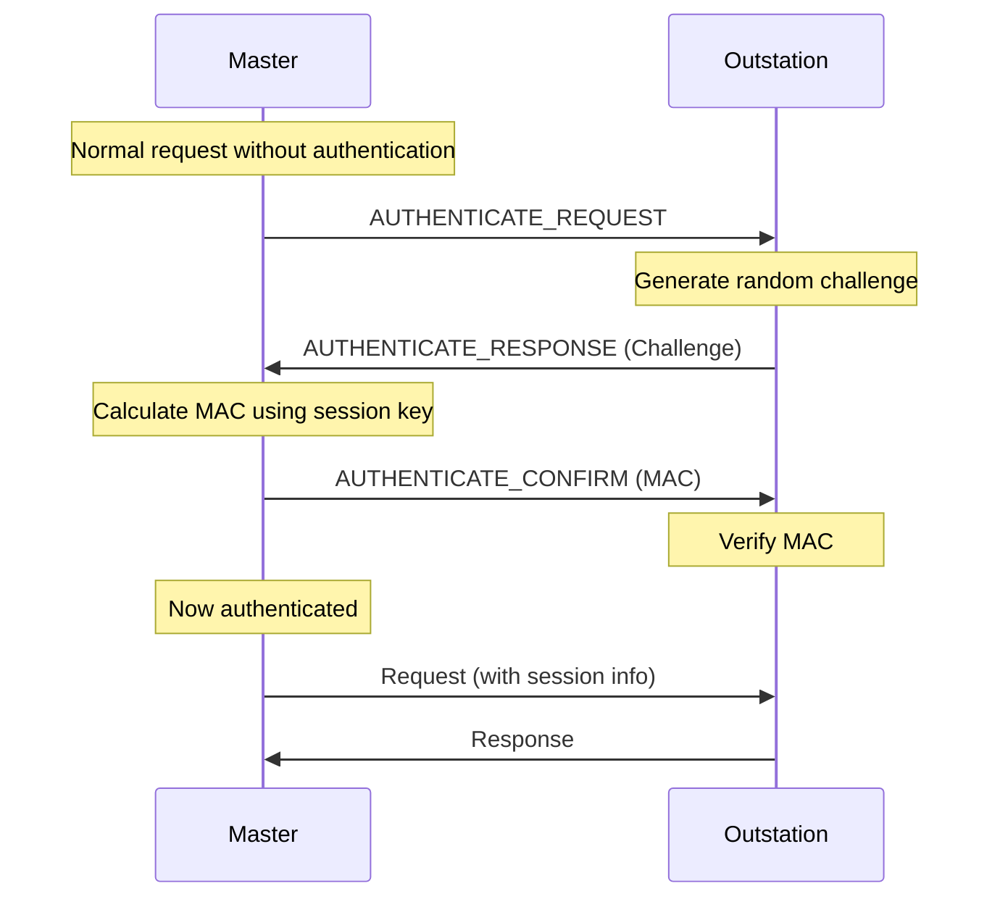
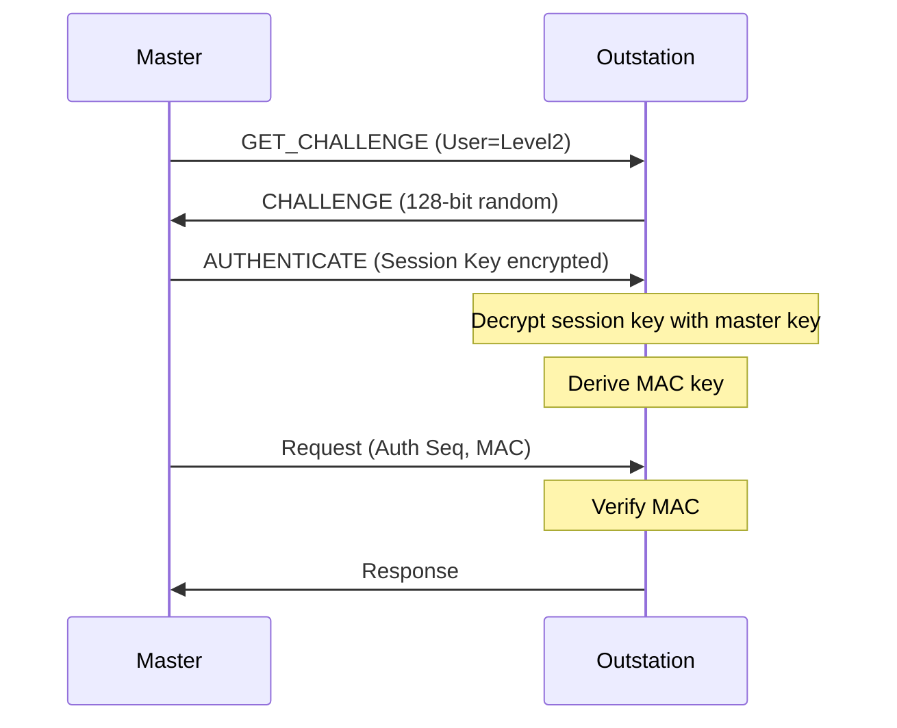

# What is DNP3 Secure Authentication?

## Purpose

DNP3 Secure Authentication (defined in IEEE 1815-2012) provides **cryptographic authentication** to prevent unauthorized control operations and data manipulation.

## Problem Being Solved

DNP3 originally had no security:

1. **No authentication** - Anyone could send commands
2. **No integrity** - Messages could be tampered
3. **No confidentiality** - Traffic could be snooped
4. **Replay attacks** - Old commands could be replayed

Secure Authentication addresses these threats.

## Security Architecture

### Key Components

```
┌──────────────────────────────────────────────────────────────────┐
│                 SECURE AUTHENTICATION ARCHITECTURE                │
├──────────────────────────────────────────────────────────────────┤
│                                                                   │
│  ┌─────────────┐     ┌─────────────┐     ┌─────────────┐        │
│  │     MAC     │     │   Session   │     │    Key      │        │
│  │  (Message   │◄────│   Key       │◄────│   Table     │        │
│  │  Auth Code) │     │             │     │             │        │
│  └─────────────┘     └─────────────┘     └─────────────┘        │
│                                                                   │
│  ┌─────────────────────────────────────────────────────────────┐ │
│  │                  CHALLENGE-RESPONSE                          │ │
│  │                                                              │ │
│  │  Master ──── Challenge ──────────────────────────────►       │ │
│  │  Master ◄─── Response (with MAC) ─────────────────────      │ │
│  │  Master ──── Authenticated Request ──────────────────►       │ │
│  │  Master ◄─── Response ─────────────────────────────────      │ │
│  │                                                              │ │
│  └─────────────────────────────────────────────────────────────┘ │
│                                                                   │
└──────────────────────────────────────────────────────────────────┘
```

## Key Concepts

### Key Table

Outstations maintain a key table with encryption keys:

| Entry | Description |
|-------|-------------|
| Key | 128-bit AES key |
| Role | What this key authorizes |
| Challenge Period | How often key must be used |
| Update Sequence | Key version tracking |

### Roles

| Role | Authorized Operations |
|------|----------------------|
| Remote | Basic read operations |
| Lvl1 | Non-critical controls |
| Lvl2 | Critical controls |
| Mgr | Configuration, key management |

### Session Key

Temporary key derived for session:

- Master generates session key
- Sent to outstation encrypted
- Used for all authenticated messages
- Expires after timeout

## Authentication Flow

### Challenge-Response Sequence



### Session Establishment



## Authentication Messages

### Function 27: AUTHENTICATE

Master sends authentication data.

### Function 28: AUTHENTICATE_CONF

Master confirms authentication response.

### Challenge-Response Objects

| Group | Description |
|-------|-------------|
| 120 | Challenge |
| 121 | Reply |
| 122 | Session Key |
| 123 | Session Key Status |
| 124 | Session Info |
| 125 | Symmetric Key |
| 126 | Asymmetric Key |
| 127 | Custom |

## Message Authentication Code (MAC)

### MAC Calculation

```
MAC = AES-CMAC(Session Key, Message Data)
```

### MAC Included In

- Authenticated requests
- Challenge/response messages
- Critical control operations

### MAC Verification

```
Received MAC = AES-CMAC(Session Key, Message)
Expected MAC = Received from master

Match → Authenticated
Mismatch → Reject
```

## Key Management

### Key Types

| Type | Purpose | Distribution |
|------|---------|--------------|
| Master Key | Derive session keys | Manual/certificate |
| Session Key | Authenticate messages | Protocol exchange |
| Update Key | Change other keys | Manual only |

### Key Update Process

1. Operator enters new key
2. Schedule key update
3. Transition period (both keys valid)
4. Old key expires

## Threats Addressed

### Threats Prevented

| Threat | Protection |
|--------|------------|
| Unauthorized control | Authentication required |
| Message tampering | MAC verification |
| Replay attacks | Sequence numbers + timestamps |
| Man-in-middle | Cryptographic exchange |

### Threats NOT Addressed

| Threat | Mitigation |
|--------|------------|
| Traffic analysis | Network security |
| Denial of service | Network protection |
| Physical access | Physical security |
| Key compromise | Key management policy |

## Security Levels

### Level 0: No Authentication

- No security
- Legacy mode
- Not recommended

### Level 1: Challenge-Response

- Authentication on connect
- Session key derived
- Basic protection

### Level 2: Per-Message Authentication

- MAC on every message
- Maximum security
- Higher overhead

## Common Mistakes

### Mistake 1: Disabling Security

**Problem**: No protection against attacks.

**Fix**: Enable and use security features.

### Mistake 2: Sharing Keys

**Problem**: Key compromise risk.

**Fix**: Use unique keys per device.

### Mistake 3: Long Key Periods

**Problem**: Extended exposure if compromised.

**Fix**: Regular key rotation.

## Engineering Notes

### Performance Implications

| Security Level | Latency Impact | Bandwidth Impact |
|---------------|----------------|------------------|
| None | None | None |
| Level 1 | High (setup) | Low |
| Level 2 | Medium | Medium |

### Implementation Notes

1. **Key storage**: Secure storage required
2. **Crypto libraries**: Use validated implementations
3. **Key management**: Secure distribution process
4. **Audit logging**: Log all authentication events

## Relationships

- **Related**: [110-controls.md](110-controls.md), [080-application-layer.md](080-application-layer.md)

## References

- IEEE 1815-2012 Section 8: Secure Authentication
- IEEE 1815-2012 Section 8.4: Authentication Exchange
- IEEE 1815-2012 Section 8.5: Key Management
